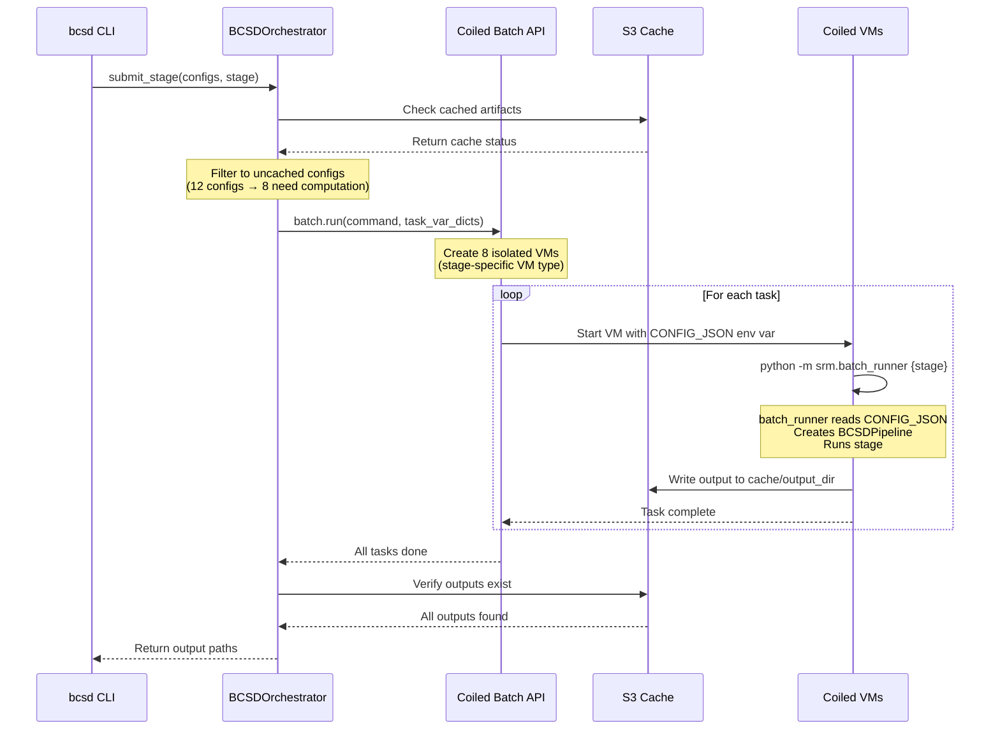
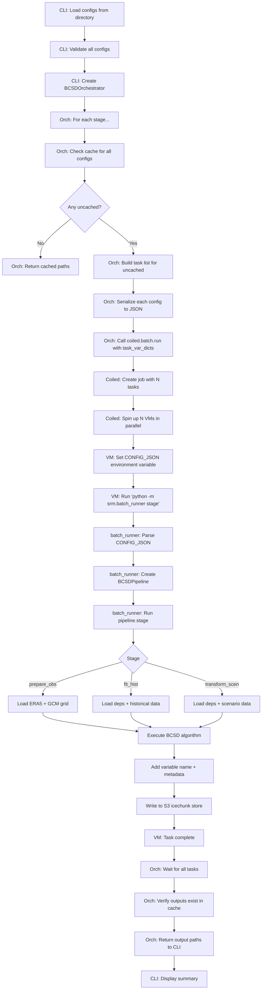

# BCSD CLI Usage Guide

The BCSD pipeline provides a command-line interface for running SRM downscaling workflows with automatic caching, resumability, and distributed execution via Coiled.

## Installation

```bash
uv sync --all-groups
```

The CLI is installed as `bcsd` command via the package entry point.

## Demo Notebook

For a complete walkthrough with visualizations, see [docs/demo-new-pipeline.ipynb](./demo-new-pipeline.ipynb). The notebook demonstrates:

- configuration setup with regional subsetting (South Africa)
- running the three-stage pipeline
- loading and visualizing results at Cape Town
- cache inspection and status checking

## Quick Start

The recommended way to run the pipeline — especially across multiple GCMs, variables, ensemble members, or scenarios — is `bcsd run-matrix`. It generates and runs every combination from the command line without needing any config files:

```bash
# 2 GCMs × 2 variables × 3 members × 2 scenarios
uv run bcsd run-matrix \
  --gcm CESM2-WACCM --gcm MIROC-ES2H \
  --variable tas --variable pr \
  --member 0 --member 1 --member 2 \
  --scenario ssp245 --scenario G6-1pt5k \
  --predict-period-start 2015 --predict-period-end 2100 \
  --cache-dir "s3://carbonplan-scratch/srm/bcsd-cache" \
  --output-dir "s3://carbonplan-scratch/srm/outputs/"
```

Use `--dry-run` to preview the generated matrix before executing:

```bash
uv run bcsd run-matrix \
  --gcm CESM2-WACCM --variable tas --member 0 \
  --scenario ssp245 --predict-period-start 2015 --predict-period-end 2100 \
  --dry-run
```

For a **single run** or when you already have a config file, use `bcsd run`:

```bash
# Run from a config file
uv run bcsd run --config-path configs/example.yaml

# Override version without editing the file
uv run bcsd run --config-path configs/example.yaml --version v2

# Override environment via environment variable
BCSD_ENVIRONMENT=production uv run bcsd run --config-path configs/example.yaml
```

Check pipeline status at any time:

```bash
uv run bcsd status --config-path configs/example.yaml --verbose
```

## Pipeline Architecture

The BCSD pipeline consists of three stages that automatically cache and reuse artifacts:

```mermaid
graph TB
    subgraph "Input Data"
        ERA5[ERA5 Observations<br/>0.25° resolution<br/>1950-present]
        GCM_HIST[GCM Historical<br/>~1-2° resolution<br/>1850-2014]
        GCM_SCEN[GCM Scenario<br/>~1-2° resolution<br/>2015-2100]
    end

    subgraph "Stage 1: prepare_observations"
        direction TB
        S1A[Load ERA5 at fine resolution]
        S1B[Load GCM grid as target]
        S1C[Apply spatial subset if specified]
        S1D[Regrid ERA5 to coarse GCM grid<br/>using local area averaging]
        S1E[Cache: obs_regridded<br/>Reused across all ensembles]
        
        S1A --> S1B --> S1C --> S1D --> S1E
    end

    subgraph "Stage 2: fit_historical"
        direction TB
        S2A[Load obs_regridded from cache]
        S2B[Load fine ERA5 observations]
        S2C[Load GCM Historical data]
        S2D[Apply spatial subset if specified]
        S2E[Time subset to training period<br/>1978-2014]
        S2F[Quantile mapping bias correction<br/>GCM historical → observations]
        S2G[Spatial disaggregation<br/>coarse → fine resolution]
        S2H[Cache: historical<br/>Reused across all scenarios]
        
        S2A --> S2B --> S2C --> S2D --> S2E
        S2E --> S2F --> S2G --> S2H
    end

    subgraph "Stage 3: transform_scenario"
        direction TB
        S3A[Load obs_regridded from cache]
        S3B[Load historical from cache]
        S3C[Load fine ERA5 observations]
        S3D[Load GCM Historical for training]
        S3E[Load GCM Scenario data]
        S3F[Apply spatial subset if specified]
        S3G[Time subset to prediction period<br/>2015-2100]
        
        S3H{Detrend needed?<br/>e.g., temperature}
        S3I[Calculate baseline climatology<br/>from historical period]
        S3J[Splice historical + scenario]
        S3K[Detrend scenario data<br/>9-year running mean]
        S3L[Save trend for later]
        
        S3M[Quantile mapping bias correction<br/>using historical period CDFs]
        
        S3N{Re-trend needed?}
        S3O[Add saved trend back]
        
        S3P[Spatial disaggregation<br/>coarse → fine resolution]
        S3Q[Add variable name and metadata]
        S3R[Write to output_dir<br/>Final publishable result]
        
        S3A --> S3B --> S3C --> S3D --> S3E
        S3E --> S3F --> S3G
        S3G --> S3H
        S3H -->|Yes| S3I --> S3J --> S3K --> S3L --> S3M
        S3H -->|No| S3M
        S3M --> S3N
        S3N -->|Yes| S3O --> S3P
        S3N -->|No| S3P
        S3P --> S3Q --> S3R
    end

    ERA5 --> S1A
    GCM_HIST --> S1B
    GCM_HIST --> S2C
    GCM_HIST --> S3D
    GCM_SCEN --> S3E
    
    S1E -.-> S2A
    S1E -.-> S3A
    S2H -.-> S3B
    
    style S1E fill:#90EE90
    style S2H fill:#90EE90
    style S3R fill:#FFD700
    
    classDef cacheNode fill:#90EE90,stroke:#228B22,stroke-width:2px
    classDef outputNode fill:#FFD700,stroke:#FF8C00,stroke-width:2px
```



**key points:**

- **stage 1 (prepare_observations)**: runs once per (GCM, variable, spatial_subset) combination
- **stage 2 (fit_historical)**: runs once per (GCM, variable, ensemble_member, spatial_subset) combination
- **stage 3 (transform_scenario)**: runs for each scenario configuration
- **green boxes**: cached intermediate artifacts in `cache_dir/{environment}/{version}/`
- **gold box**: final output in `output_dir/{environment}/{version}/`
- **dotted arrows**: cache dependencies (automatic validation)

### Cache Path Structure

```
cache_dir/{environment}/{version}/
├── obs/
│   └── {gcm}_{variable}_{subset_id}_obs_regridded.icechunk
└── historical/
    └── {gcm}_{variable}_{ensemble:03d}_{subset_id}_historical.icechunk

output_dir/{environment}/{version}/
├── historical/
│   └── {gcm}_{variable}_{ensemble:03d}_{subset_id}_historical.icechunk
└── {scenario_lower}/
    └── {gcm}_{variable}_{ensemble:03d}_{subset_id}_{scenario_lower}.icechunk
```

Where:

- `{environment}`: `qa`, `staging`, or `production`
- `{version}`: `v1`, `v2`, etc. (default: `v1`)
- `{subset_id}`: `global` or `lat{min}to{max}_lon{min}to{max}` (e.g., `lat-35.0to-22.0_lon16.0to33.0`)
- `{ensemble:03d}`: Zero-padded ensemble member (e.g., `000`, `001`)
- `{scenario_lower}`: Scenario name in lowercase (e.g., `ssp245`, `g6-1.5k`)

this structure ensures complete isolation between:

- different environments (no accidental production overwrites during testing)
- different versions (bump `version` to invalidate all cached artifacts without changing environment)
- different spatial subsets (regional vs global runs don't conflict)
- different ensemble members and scenarios

## Commands

### `bcsd run-matrix` - Run Pipeline Over a Matrix (Recommended)

> **Recommended for multi-run workflows.** Specify each dimension as a repeatable option and the CLI runs every combination — no config files needed. The orchestrator automatically deduplicates shared work across stages.

```bash
uv run bcsd run-matrix [OPTIONS]
```

**options:**

- `--gcm TEXT` (required, repeatable): GCM name
- `--variable TEXT` (required, repeatable): variable to downscale
- `--member INTEGER` (required, repeatable): ensemble member index
- `--scenario TEXT` (repeatable): scenario name. Omit for historical-only runs.
- `--predict-period-start INTEGER`: start year of prediction period (required when `--scenario` is given)
- `--predict-period-end INTEGER`: end year of prediction period (required when `--scenario` is given)
- `--train-period-start INTEGER`: start year of training period (default: `1978`)
- `--train-period-end INTEGER`: end year of training period (default: `2014`)
- `--cache-dir TEXT`: base directory for cached artifacts
- `--output-dir TEXT`: directory for final outputs
- `--environment TEXT`: environment (default: `qa`)
- `--version TEXT`: version identifier (default: `v1`)
- `--subset-bounds TEXT`: spatial bounds as `'lat_min,lat_max,lon_min,lon_max'`
- `--stage TEXT`: run specific stage (`obs`/`historical`/`scenario`/`all`, default: `all`)
- `--force`: force recompute even if cached
- `--coiled/--no-coiled`: use Coiled for distributed execution (default: `--coiled`)
- `--dry-run`: print the generated configs in a table without executing

**Examples:**

```bash
# 2 GCMs x 2 variables x 3 members x 2 scenarios 
uv run bcsd run-matrix \
  --gcm CESM2-WACCM --gcm MIROC-ES2H \
  --variable tas --variable pr \
  --member 0 --member 1 --member 2 \
  --scenario ssp245 --scenario G6-1pt5k \
  --predict-period-start 2015 --predict-period-end 2100 \
  --cache-dir "s3://carbonplan-scratch/srm/bcsd-cache" \
  --output-dir "s3://carbonplan-scratch/srm/outputs/"

# Preview what would run without executing
uv run bcsd run-matrix \
  --gcm CESM2-WACCM --gcm MIROC-ES2H \
  --variable tas \
  --member 0 --member 1 \
  --scenario ssp245 \
  --predict-period-start 2015 --predict-period-end 2100 \
  --dry-run

# Historical-only (omit --scenario)
uv run bcsd run-matrix \
  --gcm CESM2-WACCM \
  --variable tas --variable pr \
  --member 0 --member 1 --member 2

# Regional subset
uv run bcsd run-matrix \
  --gcm CESM2-WACCM \
  --variable tas \
  --member 0 \
  --scenario ssp245 \
  --predict-period-start 2015 --predict-period-end 2100 \
  --subset-bounds '-35,-22,16,33'

# Run only a specific stage
uv run bcsd run-matrix \
  --gcm CESM2-WACCM --variable tas --member 0 \
  --scenario ssp245 --predict-period-start 2015 --predict-period-end 2100 \
  --stage scenario

# Force recompute of all runs
uv run bcsd run-matrix \
  --gcm CESM2-WACCM --variable tas --member 0 \
  --scenario ssp245 --predict-period-start 2015 --predict-period-end 2100 \
  --force
```

The matrix is the cartesian product `GCMs × variables × members × scenarios`. The orchestrator automatically deduplicates shared work: `prepare_observations` runs once per (GCM, variable) combination and `fit_historical` runs once per (GCM, variable, ensemble) combination, regardless of how many scenarios are in the matrix.

**How Deduplication Works:**

```
Example: CESM2-WACCM, tas, ensembles [0,1,2], ssp245

stage 1 (prepare_observations):
  - 1 task runs (shared across all ensembles and scenarios)
  - key: (CESM2-WACCM, tas)
  - output: obs_regridded cached once, reused 3 times

stage 2 (fit_historical):
  - 3 tasks run (one per ensemble member)
  - keys: (CESM2-WACCM, tas, 0), (CESM2-WACCM, tas, 1), (CESM2-WACCM, tas, 2)
  - outputs: historical cached for each ensemble, reused across scenarios

stage 3 (transform_scenario):
  - 3 tasks run (one per ensemble/scenario combination)
  - all run in parallel since dependencies are already cached
```

### `bcsd run` - Execute Pipeline from Config File

run the BCSD downscaling pipeline for a **single config** or a **directory of pre-existing config files**.

> For new multi-run workflows, prefer `bcsd run-matrix` instead.

```bash
uv run bcsd run --config-path PATH [OPTIONS]
```

**options:**

- `--config-path TEXT` (required, repeatable): path to YAML config file or directory of configs (can be specified multiple times)
- `--stage TEXT`: run specific stage (`prepare_observations`/`fit_historical`/`transform_scenario`/`all`, default: `all`)
- `--force`: force recompute even if cached
- `--coiled/--no-coiled`: use Coiled for distributed execution (default: `--coiled`)
- `--version TEXT`: override the `version` field from the config (e.g. `v2`)

**Examples:**

```bash
# Run full pipeline for a single config
uv run bcsd run --config-path configs/example.yaml

# Run only observation regridding stage locally
uv run bcsd run --config-path configs/example.yaml --stage prepare_observations --no-coiled

# Force recompute of historical stage (ignores cache)
uv run bcsd run --config-path configs/example.yaml --stage fit_historical --force

# Override version (write outputs under v2/ path without editing config files)
uv run bcsd run --config-path configs/example.yaml --version v2

# Override environment for production run
BCSD_ENVIRONMENT=production uv run bcsd run --config-path configs/example.yaml

# Process all configs in a directory
uv run bcsd run --config-path configs/cesm2-ensemble/
```

**stage details:**

- `prepare_observations`: regrid ERA5 to GCM grid (shared across ensembles)
- `fit_historical`: debias and downscale historical period (shared across scenarios)
- `transform_scenario`: debias and downscale future scenario (final output)
- `all`: run all three stages in sequence (default)

### `bcsd status` - Check Cache Status

Check which artifacts are cached and view pipeline progress.

```bash
uv run bcsd status --config-path PATH [--verbose]
```

**options:**

- `--config-path TEXT` (required): path to config file or directory
- `--verbose`: show detailed cache and output paths
- `--version TEXT`: override the `version` field from the config

**example:**

```bash
uv run bcsd status --config-path configs/example.yaml --verbose

# Output:
# Cache Configuration:
#   Cache Path: s3://carbonplan-scratch/srm/bcsd-cache
#   Output Path: s3://carbonplan-scratch/srm/outputs
#   Environment: qa
#   Version: v1
#
# Example Paths:
#   Obs: s3://.../bcsd-cache/qa/v1/obs/CESM2-WACCM_tas_lat-35.0to-22.0_lon16.0to33.0_obs_regridded.icechunk
#   Historical: s3://.../outputs/qa/v1/historical/CESM2-WACCM_tas_000_lat-35.0to-22.0_lon16.0to33.0_historical.icechunk
#   Scenario: s3://.../outputs/qa/v1/ssp245/CESM2-WACCM_tas_000_lat-35.0to-22.0_lon16.0to33.0_ssp245.icechunk
#
# Stage Progress:
# ┏━━━━━━━━━━━━━━━━━━━━━━┳━━━━━━━┳━━━━━━━━┳━━━━━━━━━┳━━━━━━━━━━━━━━━━━┓
# ┃ Stage                ┃ Total ┃ Cached ┃ Missing ┃ Progress        ┃
# ┡━━━━━━━━━━━━━━━━━━━━━━╇━━━━━━━╇━━━━━━━━╇━━━━━━━━━╇━━━━━━━━━━━━━━━━━┩
# │ Prepare Observations │     1 │      1 │       0 │ 1/1 (100%)      │
# │ Fit Historical       │     1 │      1 │       0 │ 1/1 (100%)      │
# │ Transform Scenario   │     1 │      0 │       1 │ 0/1 (0%)        │
# └──────────────────────┴───────┴────────┴─────────┴─────────────────┘
```

### `bcsd cache-list` - List Cached Artifacts

List all cached artifacts with optional filtering.

```bash
uv run bcsd cache-list --config-path PATH [OPTIONS]
```

**options:**

- `--config-path TEXT` (required): path to config file or directory (uses cache_dir from config)
- `--stage TEXT`: filter by stage (`obs`/`historical`/`scenarios`)
- `--gcm TEXT`: filter by GCM model
- `--variable TEXT`: filter by variable

**Examples:**

```bash
# List all cached artifacts from config's cache_dir
uv run bcsd cache-list --config-path configs/example.yaml

# List only observation artifacts
uv run bcsd cache-list --config-path configs/example.yaml --stage obs

# List specific GCM/variable combination
uv run bcsd cache-list --config-path configs/example.yaml --gcm CESM2-WACCM --variable tas
```

### `bcsd cache-clear` - Clear Cache

Delete cached artifacts with optional filtering.

```bash
uv run bcsd cache-clear --config-path PATH [OPTIONS]
```

**options:**

- `--config-path TEXT` (required): path to config file or directory
- `--stage TEXT`: delete specific stage (`obs`/`historical`/`scenarios`)
- `--gcm TEXT`: delete only specific GCM
- `--variable TEXT`: delete only specific variable
- `--yes/-y`: skip confirmation prompt

**Examples:**

```bash
# Clear all cache (with confirmation)
uv run bcsd cache-clear --config-path configs/example.yaml

# Clear specific stage without confirmation
uv run bcsd cache-clear --config-path configs/example.yaml --stage scenarios --yes

# Clear specific GCM
uv run bcsd cache-clear --config-path configs/example.yaml --gcm CESM2-WACCM --yes
```

> [!WARNING]
> Cache clearing respects the `environment` setting in your config. If you have `environment: "production"`, it will only clear production cache, not qa or staging.

## Configuration

Configuration files use YAML format with Pydantic validation. all fields are validated before execution to catch errors early.

### Required Fields

```yaml
# Model identifiers
gcm: "CESM2-WACCM"                    # GCM model name
variable: "tas"                        # Variable: tas, tasmax, pr, rsds
ensemble_member: 0                     # Ensemble member (0-indexed)
scenario: "SSP245"                     # Scenario: SSP245, G6-1.5K, etc.

# Time periods
train_period_start: 1978               # Training period start year
train_period_end: 2014                 # Training period end year
predict_period_start: 2015             # Prediction period start year (required if scenario set)
predict_period_end: 2100               # Prediction period end year (required if scenario set)

# Storage
cache_dir: "s3://bucket/path"         # Base directory for intermediate artifacts
output_dir: "s3://bucket/path"        # Directory for final scenario outputs
```

### Optional Fields

```yaml
# Spatial subsetting (null for global)
subset_bounds: [-35, -22, 16, 33]     # [lat_min, lat_max, lon_min, lon_max]

# Environment isolation (default: "qa")
environment: "qa"                      # Environment: qa, staging, production
# Version identifier (default: "v1")
version: "v1"                          # Bump to invalidate all cached artifacts without changing environment


# Variable-specific settings (auto-loaded if not specified)
variable_config:
  detrend_data: true                   # Whether to detrend (auto-set based on variable)
  do_windowing: true                   # Use 31-day running window for QM
  downscaling_method: "additive"       # "additive" for temp, "multiplicative" for precip
  downscaling_clim_method: "fft"       # "fft" or "simple" climatology smoothing

# Runtime options
verbose: true                          # Enable verbose logging (default: true)
rechunk_workflow: true                 # Enable strategic rechunking (default: true)
mapping_type: "parametric"             # QM method: "parametric" or "nonparametric"
```

### Environment Variable Override

you can override the `environment` field using the `BCSD_ENVIRONMENT` environment variable, and `version` using `BCSD_VERSION`:

```bash
# Override environment for this run
BCSD_ENVIRONMENT=production bcsd run --config-path configs/example.yaml

# Override version for this run
BCSD_VERSION=v2 bcsd run --config-path configs/example.yaml
```

you can also override `version` directly on the CLI without editing the config file:

```bash
# Write outputs under v2/ paths
uv run bcsd run --config-path configs/example.yaml --version v2
```

this is useful for:

- testing configs locally with `qa` before running in `production`
- bumping `version` to invalidate all cached artifacts (e.g. after a methodological change)
- running the same config in different environments without editing the file
- ci/cd pipelines that deploy to different environments

### Variable-Specific Auto-Configuration

The pipeline automatically sets variable-specific parameters based on `BCSD_CONFIG` defaults:

| Variable | detrend_data | do_windowing | downscaling_method | downscaling_clim_method |
|----------|--------------|--------------|-------------------|------------------------|
| `tas`    | `true`       | `true`       | `additive`        | `fft`                  |
| `tasmax` | `true`       | `true`       | `additive`        | `fft`                  |
| `pr`     | `false`      | `true`       | `multiplicative`  | `simple`               |
| `rsds`   | `true`       | `true`       | `multiplicative`  | `simple`               |

you can override these in the config file if needed.

### Validation Examples

the configuration system catches common errors:

```yaml
# ❌ Missing predict periods for scenario
scenario: "SSP245"
# Error: predict_period_start and predict_period_end must be specified when scenario is set

# ❌ Invalid bounds
subset_bounds: [-35, -40, 16, 33]  # lat_min > lat_max
# Error: lat_min (-35) must be < lat_max (-40)

# ❌ Invalid time periods
train_period_start: 1990
train_period_end: 1980
# Error: train_period_end (1980) must be >= train_period_start (1990)
```

## Batch Processing

The recommended approach for all multi-run workflows is `bcsd run-matrix`. It takes the cartesian product of the dimensions you specify and handles everything — no config files to write or manage.

```bash
# 3 members × 2 scenarios for CESM2-WACCM tas, with deduplication
uv run bcsd run-matrix \
  --gcm CESM2-WACCM \
  --variable tas \
  --member 0 --member 1 --member 2 \
  --scenario SSP245 --scenario G6-1.5K \
  --predict-period-start 2015 --predict-period-end 2100 \
  --cache-dir "s3://carbonplan-scratch/srm/bcsd-cache" \
  --output-dir "s3://carbonplan-scratch/srm/outputs/" \
  --environment qa --version v1
```

The orchestrator automatically deduplicates shared work across the matrix:

- **1** `prepare_observations` task (one per GCM/variable, shared across all members and scenarios)
- **3** `fit_historical` tasks (one per ensemble member, shared across scenarios)
- **6** `transform_scenario` tasks (one per member/scenario combination)

### Multi-Scenario Example

```bash
uv run bcsd run-matrix \
  --gcm CESM2-WACCM \
  --variable tas \
  --member 0 \
  --scenario SSP245 --scenario G6-1.5K \
  --predict-period-start 2015 --predict-period-end 2100 \
  --cache-dir "s3://carbonplan-scratch/srm/bcsd-cache" \
  --output-dir "s3://carbonplan-scratch/srm/outputs/"
# obs and historical artifacts are computed once and reused for both scenarios
```

### Using Config Files (Alternative)

For workflows that are driven by version-controlled YAML config files, `bcsd run` accepts a directory of configs and applies the same deduplication logic:

<details>
<summary>Example: generating and running a directory of config files</summary>

```bash
for i in {0..2}; do
  cat > configs/batch/cesm2-tas-ssp245-e${i}.yaml <<EOF
gcm: "CESM2-WACCM"
variable: "tas"
ensemble_member: ${i}
scenario: "SSP245"
train_period_start: 1978
train_period_end: 2014
predict_period_start: 2015
predict_period_end: 2100
cache_dir: "s3://carbonplan-scratch/srm/bcsd-cache"
output_dir: "s3://carbonplan-scratch/srm/outputs"
environment: "qa"
version: "v1"
EOF
done

uv run bcsd run --config-path configs/batch/
```

</details>

## Caching & Resumability

the pipeline provides intelligent caching at multiple levels to enable efficient reuse and resumability.

### Cache Strategy

**Two-Tier Storage:**

1. **cache_dir**: intermediate artifacts that are reused across multiple runs
   - observations regridded to GCM grid (shared across all ensembles/scenarios)
   - historical downscaling (shared across all scenarios for an ensemble)

2. **output_dir**: final scenario outputs
   - downscaled scenario data with full metadata
   - organized by environment for clear separation

### Cache Locations

```
s3://carbonplan-scratch/srm/bcsd-cache/
├── qa/                                    # QA environment (testing)
│   ├── v1/                                # Version 1 artifacts
│   │   ├── obs/
│   │   │   ├── CESM2-WACCM_tas_global_obs_regridded.icechunk
│   │   │   └── CESM2-WACCM_tas_lat-35.0to-22.0_lon16.0to33.0_obs_regridded.icechunk
│   │   └── historical/
│   │       ├── CESM2-WACCM_tas_000_global_historical.icechunk
│   │       └── CESM2-WACCM_tas_000_lat-35.0to-22.0_lon16.0to33.0_historical.icechunk
│   └── v2/                                # Version 2 (after methodological changes)
│       └── ...
├── staging/
│   └── ...
└── production/
    └── ...

s3://carbonplan-scratch/srm/outputs/
├── qa/
│   ├── v1/
│   │   ├── historical/
│   │   │   └── CESM2-WACCM_tas_000_global_historical.icechunk
│   │   ├── ssp245/
│   │   │   ├── CESM2-WACCM_tas_000_global_ssp245.icechunk
│   │   │   └── CESM2-WACCM_tas_000_lat-35.0to-22.0_lon16.0to33.0_ssp245.icechunk
│   │   └── g6-1.5k/
│   │       └── CESM2-WACCM_tas_000_global_g6-1.5k.icechunk
│   └── v2/
│       └── ...
├── staging/
│   └── ...
└── production/
    └── ...
```

### Resumability

if you interrupt a run and restart with the same config:

```bash
# Start run
uv run bcsd run --config-path configs/example.yaml
^C  # Interrupt after stage 1 completes

# Check what's cached
uv run bcsd status --config-path configs/example.yaml
# Shows: prepare_observations ✓, fit_historical ✗, transform_scenario ✗

# Resume (automatically skips completed stages)
uv run bcsd run --config-path configs/example.yaml
# Only runs stages 2 and 3
```

### Cache Dependencies

the cache system validates dependencies before each stage:

```python
Stage 2 (fit_historical):
  - requires: obs_regridded
  - if missing: Raises ValueError with clear message
  
Stage 3 (transform_scenario):
  - requires: obs_regridded AND historical
  - if either missing: Raises ValueError
```

### Force Recompute

to force recomputation (ignoring cache):

```bash
# Force all stages
uv run bcsd run --config-path configs/example.yaml --force

# Force only scenario stage (keeps obs and historical cache)
uv run bcsd run --config-path configs/example.yaml --stage transform_scenario --force
```

### Cache Inspection

you can inspect cached artifacts programmatically:

```python
from srm.bcsd_config import BCSDConfig
from srm.cache import ArtifactCache

config = BCSDConfig(**yaml.safe_load(open("configs/example.yaml")))
cache = ArtifactCache(
    base_path=config.cache_dir,
    environment=config.environment,
    version=config.version,
    output_dir=config.output_dir,
)

# Check if specific artifact exists
obs_path = cache.get_obs_path(config.gcm, config.variable, config.subset_bounds)
print(f"Observations cached: {cache.exists(obs_path)}")

# List all artifacts
artifacts = cache.list_artifacts(stage="obs")
print(f"Cached observation artifacts: {len(artifacts)}")
```

## Coiled Execution

by default, the pipeline uses [Coiled](https://coiled.io) batch API for distributed, cloud-based execution.

### Architecture



### Key Benefits

1. **isolation**: each task runs on its own VM with dedicated resources
2. **parallelization**: multiple ensemble members process simultaneously
3. **auto-scaling**: VMs spin up on-demand and shut down when done
4. **fault tolerance**: failed tasks can be retried independently
5. **reproducibility**: configuration serialized and passed to each task

### VM Configuration

VM types are selected per pipeline stage to match resource requirements:

| Stage | Instance type | Notes |
|-------|---------------|-------|
| `prepare_observations` | `r8g.4xlarge` | Light data processing |
| `fit_historical` | `r8g.12xlarge` | Memory-intensive QM fitting |
| `transform_scenario` | `r8g.24xlarge` | 768GB RAM, 96 vCPUs, AWS Graviton |

- **region**: `us-west-2` (same as S3 data)
- **keepalive**: VMs stay alive briefly after task completion for follow-up work
- **AWS credentials**: Not forwarded to VMs; VMs use instance profile or environment-level credentials

### Local Execution

for testing or small regions, run locally:

```bash
# Single config (sequential execution of stages)
uv run bcsd run --config-path configs/example.yaml --no-coiled

# Multiple configs (still sequential, but useful for testing)
uv run bcsd run --config-path configs/batch/ --no-coiled
```

## Advanced Usage

### Comparing Outputs Across Code Versions

A common development workflow is to run the pipeline on a small test region against the current code, then run it again after merging new changes, and compare the two sets of outputs to validate that the changes behave as expected. The `version` field is the key mechanism for this: each run writes to a completely isolated path, so both versions of the data coexist in S3 and can be compared at any time.

**Step 1 — Run with the current code on a test region**

Pick a small region (`subset_bounds`) and use `environment: qa` so outputs stay isolated from production data. Use a version string that describes the code state, e.g. the branch name or a short commit hash.

```bash
# Run the pipeline with the current code (e.g. pre-merge main)
uv run bcsd run-matrix \
  --gcm CESM2-WACCM \
  --variable tas \
  --member 0 \
  --scenario ssp245 \
  --predict-period-start 2015 --predict-period-end 2100 \
  --subset-bounds '-35,-22,16,33' \
  --cache-dir "s3://carbonplan-scratch/srm/bcsd-cache" \
  --output-dir "s3://carbonplan-scratch/srm/outputs/" \
  --environment qa --version main-baseline 
```

Outputs will be written under `.../outputs/qa/main-baseline/...`.

**Step 2 — Merge the new code and run again with a new version**

After merging (or checking out) the new code, re-run with a different `--version`. Because the version is different, all three stages run from scratch on the same test region, producing a fully independent dataset.

```bash
# Run the pipeline with the new code (e.g. after merging a refactor branch)
uv run bcsd run-matrix \
  --gcm CESM2-WACCM \
  --variable tas \
  --member 0 \
  --scenario ssp245 \
  --predict-period-start 2015 --predict-period-end 2100 \
  --subset-bounds '-35,-22,16,33' \
  --cache-dir "s3://carbonplan-scratch/srm/bcsd-cache" \
  --output-dir "s3://carbonplan-scratch/srm/outputs/" \
  --environment qa --version refactor-icechunk 
```

Outputs will be written under `.../outputs/qa/refactor-icechunk/...`.

**Step 3 — Compare the two outputs**

Both datasets are now available at their respective version paths and can be loaded and compared side by side:

```python
import xarray as xr
import icechunk

def open_version(output_dir, environment, version, gcm, variable, member, scenario, subset_id):
    path = (
        f"{output_dir}/{environment}/{version}/{scenario.lower()}/"
        f"{gcm}_{variable}_{member:03d}_{subset_id}_{scenario.lower()}.icechunk"
    )
    bucket, _, prefix = path.removeprefix("s3://").partition("/")
    storage = icechunk.s3_storage(bucket=bucket, prefix=prefix)
    repo = icechunk.Repository.open(storage)
    ds = xr.open_dataset(repo.session, engine='zarr', chunks={})
    return ds


kwargs = dict(
    output_dir="s3://carbonplan-scratch/srm/outputs",
    environment="qa",
    gcm="CESM2-WACCM",
    variable="tas",
    member=0,
    scenario="ssp245",
    subset_id="lat-35.0to-22.0_lon16.0to33.0",
)

ds_baseline = open_version(**kwargs, version="main-baseline")
ds_new      = open_version(**kwargs, version="refactor-icechunk")

diff = ds_new["tas"] - ds_baseline["tas"]
print(diff.max().values, diff.min().values)  # should be ~0 for a pure refactor
```

**Tips**

- Keep `environment: qa` for all test runs so they never touch staging or production paths.
- Use descriptive `--version` strings (branch names, commit hashes, date stamps) rather than `v1`/`v2` so it is always clear which code produced which data.
- Use `bcsd status` to confirm both versions completed before comparing:

  ```bash
  uv run bcsd status --config-path configs/example.yaml --version main-baseline
  uv run bcsd status --config-path configs/example.yaml --version refactor-icechunk
  ```

- Once you are done comparing, clean up test artifacts with `bcsd cache-clear`:

  ```bash
  # The cache-clear command uses the version from your config;
  # point it at a config that has the version you want to remove.
  uv run bcsd cache-clear --config-path configs/example.yaml --yes
  ```

### Multi-Model Ensemble

The easiest way to process multiple GCMs, variables, ensemble members, and scenarios is a single `run-matrix` invocation:

```bash
# 3 GCMs × 1 variable × 3 members × 1 scenario = 9 runs
# Stage 1: 3 obs tasks (one per GCM)
# Stage 2: 9 historical tasks (3 per GCM)
# Stage 3: 9 scenario tasks
uv run bcsd run-matrix \
  --gcm CESM2-WACCM --gcm MIROC-ES2H --gcm UKESM \
  --variable tas \
  --member 0 --member 1 --member 2 \
  --scenario SSP245 \
  --predict-period-start 2015 --predict-period-end 2100 \
  --cache-dir "s3://carbonplan-scratch/srm/bcsd-cache" \
  --output-dir "s3://carbonplan-scratch/srm/outputs/" \
  --environment production --version v1 \
  --coiled
```

## Architecture & Implementation

### Code Organization

the CLI is built on several key components:

1. **BCSDConfig** ([src/srm/bcsd_config.py](../src/srm/bcsd_config.py))
   - Pydantic v2 configuration with comprehensive validation
   - field validators for SAI scenarios, time periods, spatial bounds
   - computed fields: `run_id`, `config_hash`, `detrend_data`, etc.
   - environment variable override support via `model_config`

2. **ArtifactCache** ([src/srm/cache.py](../src/srm/cache.py))
   - S3-based cache with fsspec backend
   - dependency tracking and validation
   - environment and spatial subset awareness
   - icechunk format with commit-based write verification
   - efficient prefix-based listing (not recursive globbing)

3. **BCSDPipeline** ([src/srm/pipeline.py](../src/srm/pipeline.py))
   - three-stage API
   - each stage: check cache → compute if needed → write to cache
   - automatic metadata preservation (units, attributes)
   - rechunking strategy for optimal Dask performance

4. **BCSDOrchestrator** ([src/srm/orchestration.py](../src/srm/orchestration.py))
   - batch execution with Coiled integration
   - automatic task deduplication across stages
   - status tracking and reporting
   - error handling and output verification

5. **batch_runner** ([src/srm/batch_runner.py](../src/srm/batch_runner.py))
   - entry point for Coiled batch jobs
   - reads serialized config from `CONFIG_JSON` environment variable
   - creates pipeline and runs requested stage
   - minimal dependencies for fast VM startup

6. **CLI** ([src/srm/cli.py](../src/srm/cli.py))
   - typer-based command-line interface
   - rich formatting for tables and progress display
   - configuration loading and validation
   - orchestrator coordination

### Batch Execution Flow

detailed flow when running `uv run bcsd run --config-path configs/ --coiled`:



### Cache Path Generation Logic

the cache system generates deterministic paths based on configuration:

```python
def _get_subset_id(subset_bounds):
    """Generate spatial subset identifier"""
    if subset_bounds is None:
        return "global"
    lat_min, lat_max, lon_min, lon_max = subset_bounds
    return f"lat{lat_min}to{lat_max}_lon{lon_min}to{lon_max}"

# Examples:
# global → "global"
# [-35, -22, 16, 33] → "lat-35.0to-22.0_lon16.0to33.0"
# [31, 49, -125, -102] → "lat31.0to49.0_lon-125.0to-102.0"

def get_obs_path(gcm, variable, subset_bounds):
    subset_id = _get_subset_id(subset_bounds)
    return f"{cache_dir}/{environment}/{version}/obs/{gcm}_{variable}_{subset_id}_obs_regridded.icechunk"

def get_historical_path(gcm, variable, ensemble, subset_bounds):
    subset_id = _get_subset_id(subset_bounds)
    if output_dir:
        return f"{output_dir}/{environment}/{version}/historical/{gcm}_{variable}_{ensemble:03d}_{subset_id}_historical.icechunk"
    else:
        return f"{cache_dir}/{environment}/{version}/historical/{gcm}_{variable}_{ensemble:03d}_{subset_id}_historical.icechunk"

def get_scenario_path(gcm, variable, ensemble, scenario, subset_bounds):
    subset_id = _get_subset_id(subset_bounds)
    scenario_lower = scenario.lower()
    if output_dir:
        return f"{output_dir}/{environment}/{version}/{scenario_lower}/{gcm}_{variable}_{ensemble:03d}_{subset_id}_{scenario_lower}.icechunk"
    else:
        return f"{cache_dir}/{environment}/{version}/{scenario_lower}/{gcm}_{variable}_{ensemble:03d}_{subset_id}_{scenario_lower}.icechunk"
```

this ensures:

- **environment isolation**: qa/staging/production never mix
- **spatial subset separation**: Global vs regional runs have different paths
- **deterministic lookups**: Same config always produces same path
- **human-readable**: Paths are self-documenting
