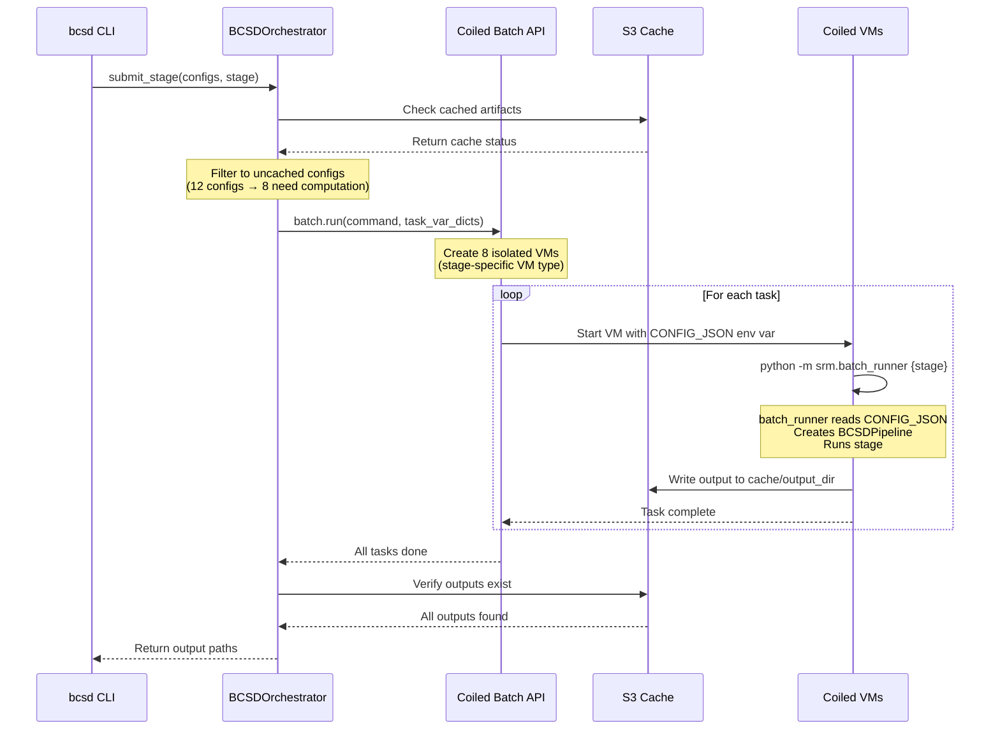
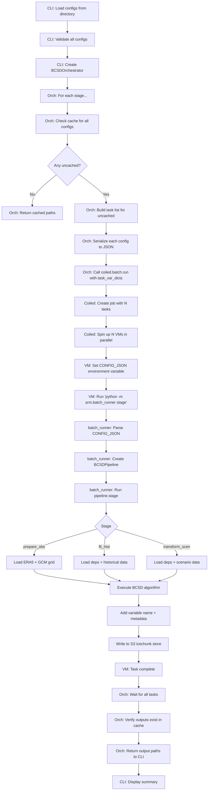

# Pipeline Architecture

This page explains how the BCSD downscaling pipeline is structured, why it is designed the way it is, and how its components fit together.

## The Three-Stage Pipeline

The BCSD pipeline consists of three stages that automatically cache and reuse artifacts:

```mermaid
graph TB
    subgraph "Input Data"
        ERA5[ERA5 Observations<br/>0.25° resolution<br/>1950-present]
        GCM_HIST[GCM Historical<br/>~1-2° resolution<br/>1850-2014]
        GCM_SCEN[GCM Scenario<br/>~1-2° resolution<br/>2015-2100]
    end

    subgraph "Stage 1: prepare_observations"
        direction TB
        S1A[Load ERA5 at fine resolution]
        S1B[Load GCM grid as target]
        S1C[Apply spatial subset if specified]
        S1D[Regrid ERA5 to coarse GCM grid<br/>using local area averaging]
        S1E[Cache: obs_regridded<br/>Reused across all ensembles]
        
        S1A --> S1B --> S1C --> S1D --> S1E
    end

    subgraph "Stage 2: fit_historical"
        direction TB
        S2A[Load obs_regridded from cache]
        S2B[Load fine ERA5 observations]
        S2C[Load GCM Historical data]
        S2D[Apply spatial subset if specified]
        S2E[Time subset to training period<br/>1978-2014]
        S2F[Quantile mapping bias correction<br/>GCM historical → observations]
        S2FC[Write debiased_coarse/historical<br/>to output store]
        S2G[Spatial disaggregation<br/>coarse → fine resolution]
        S2H[Output: historical<br/>Deliverable + scenario gate]
        
        S2A --> S2B --> S2C --> S2D --> S2E
        S2E --> S2F --> S2FC
        S2F --> S2G --> S2H
    end

    subgraph "Stage 3: transform_scenario"
        direction TB
        S3A[Load obs_regridded from cache]
        S3B[Check historical exists<br/>completion gate]
        S3C[Load fine ERA5 observations]
        S3D[Load GCM Historical for training]
        S3E[Load GCM Scenario data]
        S3F[Apply spatial subset if specified]
        S3G[Time subset to prediction period<br/>2015-2100]
        
        S3H{Detrend needed?<br/>e.g., temperature}
        S3I[Calculate baseline climatology<br/>from historical period]
        S3J[Splice historical + scenario]
        S3K[Detrend scenario data<br/>9-year running mean]
        S3L[Save trend for later]
        
        S3M[Quantile mapping bias correction<br/>using historical period CDFs]
        
        S3N{Re-trend needed?}
        S3O[Add saved trend back]
        S3OC[Write debiased_coarse/scenario<br/>to output store]
        
        S3P[Spatial disaggregation<br/>coarse → fine resolution]
        S3Q[Add variable name and metadata]
        S3R[Write to output_dir<br/>Final publishable result]
        
        S3A --> S3B --> S3C --> S3D --> S3E
        S3E --> S3F --> S3G
        S3G --> S3H
        S3H -->|Yes| S3I --> S3J --> S3K --> S3L --> S3M
        S3H -->|No| S3M
        S3M --> S3N
        S3N -->|Yes| S3O --> S3OC
        S3N -->|No| S3OC
        S3OC --> S3P
        S3P --> S3Q --> S3R
    end

    ERA5 --> S1A
    GCM_HIST --> S1B
    GCM_HIST --> S2C
    GCM_HIST --> S3D
    GCM_SCEN --> S3E
    
    S1E -.-> S2A
    S1E -.-> S3A
    S2H -.-> S3B
    
    style S1E fill:#90EE90
    style S2H fill:#FFD700
    style S3R fill:#FFD700
    
    classDef cacheNode fill:#90EE90,stroke:#228B22,stroke-width:2px
    classDef outputNode fill:#FFD700,stroke:#FF8C00,stroke-width:2px
```



**Key points:**

- **stage 1 (prepare_observations)**: runs once per (GCM, variable, spatial_subset) combination
- **stage 2 (fit_historical)**: runs once per (GCM, variable, ensemble_member, spatial_subset) combination; writes fine-res historical **and** debiased coarse historical to the output store (coarse only for `dtr`, see [Derived variables](#derived-variables-tasmin))
- **stage 3 (transform_scenario)**: runs for each scenario configuration; writes fine-res scenario and debiased coarse scenario to the output store (coarse only for `dtr`)
- **green boxes**: cached intermediate artifacts (obs regridded) in the scratch icechunk store, on the active branch
- **gold boxes**: deliverables in the output icechunk store, on the active branch (fine-res historical + fine-res scenario + debiased coarse data)
- **dotted arrows**: cache dependencies (automatic validation)

## Derived variables: `tasmin`

Daily minimum temperature is **not** bias-corrected directly. Bias-correcting `tasmax` and `tasmin` independently can leave the pair physically inconsistent, so the pipeline instead bias-corrects `tasmax` and the diurnal temperature range `dtr` (`= tasmax − tasmin`) and reconstructs `tasmin = tasmax − dtr` from their debiased-coarse outputs. This mirrors the NASA-NEX approach and is implemented in the dedicated stage variants `fit_historical_tasmin` and `transform_scenario_tasmin`, which read the `debiased_coarse` `tasmax` and `dtr` groups written by those stages (see [Managing the Cache](../how-to/manage-cache.md)). The reconstruction helper (`derive_tasmin`) requires its two inputs to share an identical time axis and raises if they do not, so a truncated or misaligned `dtr` fails loudly instead of silently NaN-filling the result (issue #363).

`tasmax` and `tasmin` are still spatially disaggregated **independently**, and that final interpolation can push a small number of fine cells to `tasmax < tasmin`. A dedicated reconcile step (`reconcile_temperature_extremes`) closes this gap: once both fine fields exist it swaps the offending cells so `tasmax >= tasmin` holds everywhere, then rewrites both corrected fields (issue #331). The swap is NaN-safe and structurally monotone, and the `bcsd validate-output` gate blocks any run whose stored output still contains an inversion.

Both behaviors are keyed on the **variable**, not on which entry point runs the stage. `fit_historical` and `transform_scenario` route a `tasmin` config to their `_tasmin` variants at the top of the method, so the distributed `batch_runner`, the local `run_full_pipeline`, and the CLI all produce derived-and-reconciled `tasmin` identically. Because the derivation reads the `tasmax` and `dtr` outputs, `tasmin` must run after them; `BCSDOrchestrator` enforces this by scheduling `tasmin` in a later intra-stage dependency wave.

### `dtr` is bias-corrected but not published

`dtr` exists only to make the `tasmin` reconstruction possible. The reconcile step above adjusts the fine `tasmax`/`tasmin` pair without revisiting `dtr`, so a disaggregated `dtr` would no longer equal `tasmax − tasmin` and would mislead anyone reading it as the diurnal range. Both stages therefore return immediately after writing its `debiased_coarse` group (issue #461):

| Aspect | Behavior for `dtr` |
| --- | --- |
| Groups written | `debiased_coarse/historical/dtr/{member}` and `debiased_coarse/{scenario_group}/dtr/{member}` only |
| Groups **not** written | `historical/dtr/{member}`, `{scenario_group}/dtr/{member}` |
| Spatial disaggregation | Skipped entirely, so the stage's most expensive step never runs |
| Stage-completion marker | The `debiased_coarse` group, via `ArtifactCache.stage_loc` |
| Config files | Unchanged: `dtr` stays in every `variables:` list, because `tasmin` needs it |

The rule is declared once, as `COARSE_ONLY_VARIABLES` in `srm/cache.py`. `ArtifactCache.stage_loc` is the single place that maps a stage to the artifact marking it complete, so the pipeline's write path, the orchestrator's cache-skip and retry logic, and the downstream dependency gate all agree on where `dtr` ends.

## Cache Store Structure

Each `(GCM, obs-dataset, spatial-subset)` combination gets exactly two icechunk repositories — one
for scratch intermediates, one for final outputs. All artifact groups live inside those repos as
zarr group paths on a named branch (defaulting to the installed package version):

```text
# Scratch store — obs regridded + optional intermediates
s3://carbonplan-scratch/srm/cache/{environment}/{gcm}-{obs_dataset}-{subset_id}.icechunk
  branch: v1.2.3        ← installed package version (BCSD_BRANCH to override)
    obs/{variable}
    detrended_scenario/{scenario_group}/{variable}/{ensemble_member}  # only if save_intermediate=True
    trend_scenario/{scenario_group}/{variable}/{ensemble_member}      # only if save_intermediate=True
    debiased_scenario/{scenario_group}/{variable}/{ensemble_member}   # only if save_intermediate=True

# Output store — fine-res historical + scenario results + debiased coarse data
s3://carbonplan-scratch/srm/outputs/{environment}/{gcm}-{obs_dataset}-{subset_id}.icechunk
  branch: v1.2.3
    historical/{variable}/{hist_member}
    {scenario_group}/{variable}/{ensemble_member}
    debiased_coarse/historical/{variable}/{hist_member}
    debiased_coarse/{scenario_group}/{variable}/{ensemble_member}
```

Where:

- `{environment}`: `qa` or `production`
- `{obs_dataset}`: `ERA5` or `GDEX-GMF`
- `{subset_id}`: `global` or `lat{min}to{max}_lon{min}to{max}` (e.g., `lat-35.0to-22.0_lon16.0to33.0`)
- `{scenario_group}`: `ssp245`, `g6_1p5k`, or `esgf_ssp245`
- `{ensemble_member}`: member label as stored in the GCM (e.g., `r1i1p1f1`, `001`)

This design concentrates all artifacts for a GCM into two stores instead of scattering them across
dozens of separate icechunk repositories. Branching — rather than path segments — provides version
isolation: bumping the package version (or setting `BCSD_BRANCH`) starts a fresh branch with no
inherited ancestry, so the existence checks never find stale artifacts from a previous run.

The paths above are the scratch defaults. Production runs override `output_dir` to CarbonPlan's
public [Source Cooperative repository](https://source.coop/carbonplan/srm-downscaling), so the
current published outputs live at
`s3://us-west-2.opendata.source.coop/carbonplan/srm-downscaling/output/production/CESM2-WACCM-ERA5-global.icechunk`
on branch `v0.12.0`. See [How to Access Downscaled Output Data](../access-data.md) for reading
published stores.

## Coiled Execution

By default, the pipeline uses [Coiled](https://coiled.io) batch API for distributed, cloud-based execution.

### Architecture



### Key Benefits

1. **isolation**: each task runs on its own VM with dedicated resources
2. **parallelization**: multiple ensemble members process simultaneously
3. **auto-scaling**: VMs spin up on-demand and shut down when done
4. **fault tolerance**: failed tasks can be retried independently
5. **reproducibility**: configuration serialized and passed to each task

### VM Configuration

VM types are selected per pipeline stage to match resource requirements:

| Stage | Instance type | Notes |
| --- | --- | --- |
| `prepare_observations` | `r8g.4xlarge` | Light data processing |
| `fit_historical` | `r8g.12xlarge` | Memory-intensive QM fitting |
| `transform_scenario` | `r8g.24xlarge` | 768GB RAM, 96 vCPUs, AWS Graviton |

- **region**: `us-west-2` (same as S3 data)
- **keepalive**: VMs stay alive briefly after task completion for follow-up work
- **AWS credentials**: Not forwarded to VMs; VMs use instance profile or environment-level credentials

## Code Organization

The CLI is built on several key components:

1. **BCSDConfig** + **PipelineOptions** ([src/srm/bcsd_config.py](../../src/srm/bcsd_config.py))
   - **BCSDConfig** — run identity: `gcm`, `variable`, `ensemble_member`, `scenario`, time periods, `subset_bounds`, `variable_config`. Field validators for SAI scenarios, time periods, spatial bounds. Computed fields: `run_id`, `config_hash`, `is_sai_scenario`. Variable-specific parameters (`detrend_data`, `downscaling_method`, `debias_approach`, etc.) live only on the nested `variable_config`, never as accessors on `BCSDConfig`.
   - **PipelineOptions** — operational: `scratch_dir`, `output_dir`, `environment`, `branch`, `verbose`, `rechunk_workflow`, `apply_ocean_mask`, `save_intermediate`, `clip_values`, `clip_bounds`. The `branch` field (default: installed package version) names the icechunk branch all artifacts are written to and read from.
   - Both extend `pydantic_settings.BaseSettings` with `env_prefix = "BCSD_"` and `extra = "ignore"`, so a single flat YAML populates both classes.

2. **ArtifactCache** ([src/srm/cache.py](../../src/srm/cache.py))
   - S3-based cache with fsspec backend
   - dependency tracking and validation
   - environment and spatial subset awareness
   - icechunk format with commit-based write verification
   - efficient prefix-based listing (not recursive globbing)

3. **BCSDPipeline** ([src/srm/pipeline.py](../../src/srm/pipeline.py))
   - three-stage API
   - each stage: check cache → compute if needed → write to cache
   - automatic metadata preservation (units, attributes)
   - rechunking strategy for optimal Dask performance

4. **BCSDOrchestrator** ([src/srm/orchestration.py](../../src/srm/orchestration.py))
   - batch execution with Coiled integration
   - automatic task deduplication across stages
   - status tracking and reporting
   - error handling and output verification

5. **batch_runner** ([src/srm/batch_runner.py](../../src/srm/batch_runner.py))
   - entry point for Coiled batch jobs
   - reads `CONFIG_JSON` environment variable (structure: `{"options": {...PipelineOptions fields...}, ...BCSDConfig fields...}`)
   - pops the `"options"` key to construct `PipelineOptions`; remaining keys construct `BCSDConfig`
   - creates `BCSDPipeline(config, options)` and runs the requested stage
   - minimal dependencies for fast VM startup

6. **CLI** ([src/srm/cli.py](../../src/srm/cli.py))
   - typer-based command-line interface
   - rich formatting for tables and progress display
   - configuration loading and validation
   - orchestrator coordination

## Batch Execution Flow

Detailed flow when running `uv run bcsd run --config-path configs/ --coiled`:



## Artifact Location and Existence Checks

`ArtifactCache` translates a `BCSDConfig` into a `StoreLocation` — a pairing of an icechunk
repository path and a zarr group path within it. The store path is derived from
`(environment, gcm, obs_dataset, subset_id)`; the group path encodes the stage and the specific
run parameters (variable, ensemble member, scenario group). Because both components are
deterministic given the config, the same config always maps to the same `StoreLocation` on every
run and across machines.

Existence is checked by walking the icechunk commit ancestry on the current branch and looking for
a commit whose message equals the group path. This is atomic: a partially-written group (whose
commit was never finalized) is invisible to the check, so interrupted runs can safely resume by
writing the group again without risking a false cache hit.
