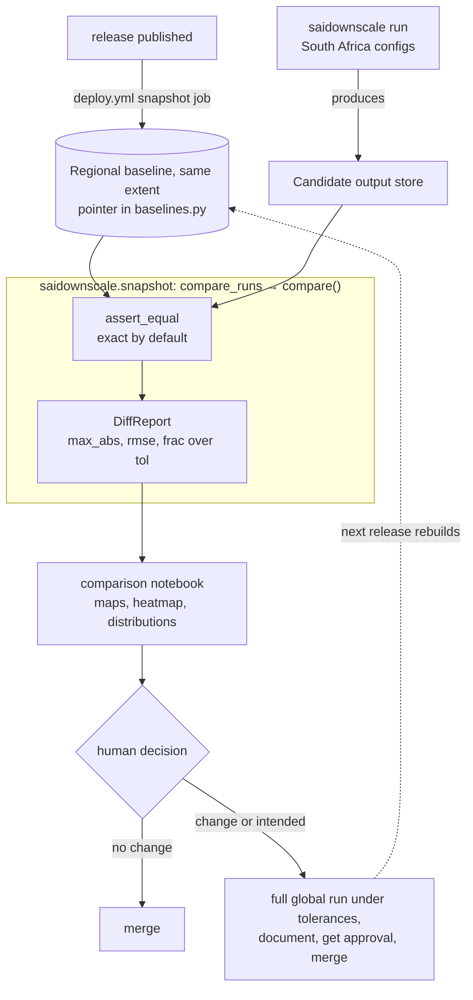

# Snapshot regression testing

This page explains why we built a snapshot regression check into the downscaling pipeline, and why
it works the way it does. For the per-pull-request procedure, see
[Compare a run against the snapshot](../how-to/run-snapshot-tests.md). The check answers issue #410:
catch scientific drift before it merges, without paying for a full global comparison on every
change.

## How it works

A cheap South Africa run produces candidate output, and `compare_runs` diffs it against a regional
baseline on the same extent for exact equality. The comparison notebook then renders the
`DiffReport` as maps and tables for a human to judge.

## Why we snapshot, and why tolerances

Downscaled output is a long chain of numerical operations (bias correction, detrending, regridding,
and spatial disaggregation) layered on `ibicus`, `xarray_regrid`, `dask`, and `icechunk`. A refactor
meant to be a no-op, or a routine dependency bump, can shift a temperature field by a tenth of a
degree across a whole scenario without failing a single test, because the pipeline still produces a
plausible dataset.

We snapshot to make that drift loud. The check freezes a blessed run and compares fresh output
against it cell by cell, so a silent shift surfaces as a failure instead of a believable number.

The default comparison is **exact equality**. We measured, rather than assumed, that 2 runs of the
same configs at the same commit over the same spatial extent are bit-identical, so any difference at
all is a code change. `compare()` takes its verdict from `xarray.testing.assert_equal`, which
also checks dimension names and index identity; `frac_over_tol` is descriptive and must never be
used as the gate.

That holds only when both runs cover the same spatial extent, which is why the regional baseline
shares the candidate's `subset_bounds`. Across *different* extents, 2 runs disagree in the last 1
or 2 digits the stored numbers can hold, roughly 0.00006 W/m² on a solar radiation field near
200 W/m². That is rounding, not science, but it is not zero, so a regional-against-global
comparison still needs a tolerance band;
[issue #575](https://github.com/carbonplan/sai-downscaling/issues/575) tracks why.

For that case, pass `saidownscale.snapshot.tolerances.TOLERANCES` to restore the band. It passes a
cell when `abs(candidate - snapshot) <= atol + rtol * abs(snapshot)`, the
`xarray.testing.assert_allclose` rule. A variable absent from the mapping is compared exactly, so a
partial mapping can only tighten a comparison. In either mode a leaf passes only when no cell is
over tolerance, no cell disagrees on NaN-ness, and the dimension names, shapes, and coordinates all
match.

## Per-variable tolerances

If you compare 2 runs over different spatial extents, you need a tolerance band, and one band cannot
fit every variable. We hold the relative tolerance (`rtol`) uniform at `1e-5` and tune the absolute
tolerance (`atol`) per variable, because `atol` is what dominates near zero where the relative term
vanishes. The table below gives each value and why we chose it.

| Variable | `atol` | Why this value |
| --- | --- | --- |
| `tas`, `tasmax`, `dtr` | `1e-3` K | The baseline. Temperature in kelvin sits around 250 to 310, so roundoff is small next to the signal |
| `tasmin` | `2e-3` K | Derived as `tasmax - dtr`, so its drift is the sum of both inputs' floors |
| `pr` | `1e-10` kg m-2 s-1 | Tighter, because stored precipitation values are tiny, around `1e-5` |
| `rsds` | `1e-2` W m-2 | Looser, because solar radiation spans roughly 0 to 1000 |
| `hurs` | `1e-2` % | Looser, because relative humidity spans roughly 0 to 100 |
| Anything unlisted | `1e-3` | The default fallback |

We seeded these loose enough to absorb noise across library versions and tight enough to catch a
real scientific change. Expect to tune them as you learn how far each variable wanders between
blessed runs.

## The baseline and the cheap proxy

We keep 2 baselines in `saidownscale.snapshot.baselines`, each a store URI and an icechunk branch.
Which run is the baseline is a version-controlled value that the notebook and `compare_runs` both
read, so repointing it is a reviewed edit rather than an untracked change on a bucket.

| Pointer | Mode | Run | Verdict |
| --- | --- | --- | --- |
| `CESM2_WACCM_SOUTH_AFRICA` | `southafrica` (default) | regional, same `subset_bounds` as the candidate | exact |
| `CESM2_WACCM_GLOBAL` | `global` | the blessed global run on [Source Cooperative](https://source.coop/carbonplan/srm-downscaling) | tolerance band |

The `snapshot` job in `.github/workflows/deploy.yml` produces the regional baseline automatically on
every published release, then freezes it under an icechunk tag. Repointing
`CESM2_WACCM_SOUTH_AFRICA` at the new release is the one manual step, and the job's summary prints
both fields to paste, the store URI as well as the branch.

Comparing full global output on every change would be prohibitively expensive, so the routine check
runs over the South Africa subset. The [how-to guide](../how-to/run-snapshot-tests.md) covers the
halo and trimming mechanics.

A regional baseline also removes a limitation the old global baseline carried. The bias correction
fits a per-variable distribution: `tas`, `tasmax`, and `tasmin` use a numerically stable Gaussian,
but `hurs`, `rsds`, and `dtr` use iterative maximum-likelihood fits (a beta distribution, with
Weibull and Gumbel tails) that are sensitive to tiny input perturbations. Against a *global*
baseline the domain window changes the regrid reduction order and perturbs those fits, so those 3
diff spuriously and have to be judged from `mode = "global"`. Against a same-extent regional
baseline both sides feed identical inputs to the fits, so all 7 variables are reliable and any
difference is real.

## Human judgment and the label gate

The check produces evidence, not a merge decision. When every leaf is within tolerance and no change
was intended, the pull request is safe to merge; when a leaf moves, or the change was meant to move
the outputs, the author produces a full global run, documents what changed and why, and gets
sign-off before merging and repointing the baseline. Leaves present on only one side are reported
rather than silently skipped, so a variable that appears or disappears is never mistaken for "no
change".

The only automated gate is the `snapshot-required` workflow, which blocks a modeling-code change
until it carries the `snapshot-verified` label, and exempts docs-only changes. It confirms that the
human process happened rather than recomputing a verdict of its own.
