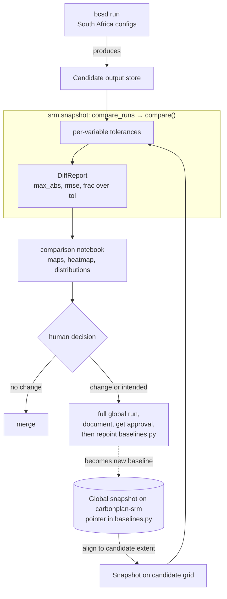

# Snapshot Regression Testing

This page explains why the BCSD pipeline has a snapshot regression check, what it actually protects against, and why it is designed the way it is. It is background reading: for the concrete, per-pull-request procedure, see [How to Compare a Run Against the Snapshot](../how-to/run-snapshot-tests.md). The check itself is issue #410's request — catch scientific drift before it merges, without paying for a full global comparison on every change.

## How it works in action

At a high level, the check takes a cheap candidate run and the canonical global snapshot, aligns the snapshot to the candidate's extent, and diffs them through a single tolerance-aware engine. The result feeds the comparison notebook, whose maps and tables a human reads to decide whether the change is safe to merge.

The diagram traces the loop: a South Africa run produces candidate output, `compare_runs` aligns the global snapshot to that regional extent and measures the difference under per-variable tolerances, and the notebook turns the `DiffReport` into visual diagnostics. A human then decides — a clean comparison merges directly, while any change routes to a full global run and a documented, approved baseline update.

## The problem: silent scientific drift

Downscaled climate output is the product of a long chain of numerical operations — quantile-mapping bias correction, detrending, regridding, and spatial disaggregation — layered on top of libraries like `ibicus`, `xarray_regrid`, `dask`, and `icechunk`. When any link in that chain changes, the numbers can shift without any test failing, because the pipeline still runs to completion and still produces a plausible-looking dataset. A refactor meant to be a no-op, or a routine dependency bump, can quietly move a temperature field by a tenth of a degree across a whole scenario.

Snapshot testing exists to make that kind of drift loud instead of silent. The idea is to freeze a blessed run as a baseline and, on every subsequent change, compare fresh output against it cell by cell. If nothing moved beyond an expected floating-point wobble, the change is safe to merge; if something moved, a human decides whether the shift is an intended scientific improvement or an accidental regression.

## Why tolerance-aware comparison, not exact match

A bitwise or exact-equality comparison would be useless here, because the pipeline is not bit-reproducible. `dask` reductions accumulate in nondeterministic order, regridding weights differ subtly across library versions, and floating-point arithmetic is not associative, so two runs of identical code on identical inputs can disagree in the last few digits. A test that flagged those differences would fail constantly and teach everyone to ignore it.

The comparison is therefore tolerance-aware: a cell passes when `abs(candidate - snapshot) <= atol + rtol * abs(snapshot)`, the same rule as `xarray.testing.assert_allclose`. This absorbs the meaningless noise while still catching a real scientific change, which by construction is far larger than a rounding difference. The verdict for a whole leaf is simply that no cell is over tolerance, no cell disagrees on NaN-ness, and the shapes match.

## Per-variable tolerances

A single global tolerance cannot fit every variable, because the variables live on different scales and have different failure modes. Temperature fields in kelvin are well-behaved around 250–310, so a small relative tolerance is meaningful, but precipitation is dominated by values at or near zero, where relative tolerance is meaningless — `rtol * abs(snapshot)` collapses to nothing and every dry cell becomes hair-trigger sensitive. Precipitation is therefore given a pure absolute tolerance instead.

The policy lives in `srm.snapshot.tolerances` as a per-variable table, with a default fallback for anything unlisted. These seed values are deliberately loose enough to absorb cross-version nondeterminism and tight enough to catch a genuine shift; they are starting points, expected to be tuned as the team learns how much each variable actually wanders between blessed runs.

## One global snapshot as the source of truth

There is a single canonical baseline: the blessed **global** run on the `carbonplan-srm` bucket. Rather than track it out of band, `srm.snapshot.baselines.CESM2_WACCM_GLOBAL` records its store URI and icechunk branch, so "which run is the baseline" is a version-controlled value that the comparison notebook and `compare_runs` both read. Repointing the baseline at a new global run is therefore a reviewed edit to `baselines.py`, not an untracked side effect on a bucket.

Comparing full global output on every change would be prohibitively expensive, so the routine per-pull-request check runs over a small South Africa subset instead. To make that regional candidate comparable to the global baseline, the notebook subsets the global snapshot to the candidate's extent with a plain per-leaf `.sel` before comparing — a straightforward selection, not a coordinate reconciliation, so if the two grids do not actually line up the selection fails loudly rather than papering over the mismatch. The comparison engine itself does no alignment: `compare_runs` diffs two stores as-is, and the verdict comes from `xarray.testing.assert_allclose`, which checks dimensions, coordinates, and values together. The cheap South Africa check and the full global check therefore share one comparison engine and one tolerance policy; only the notebook's subset step differs.

## Human judgment, with the label as the only gate

The comparison does not merge anything by itself; it produces evidence and a human makes the call. When the notebook shows every leaf within tolerance and no change was intended, the pull request is safe to merge. When a leaf moves — or the change was meant to move the outputs — the cheap subset is not enough: the author produces a full global run, documents what changed and why, and gets sign-off before merging and repointing the baseline. Leaves present on only one side are reported rather than silently skipped, so a scenario or variable that appears or disappears is never mistaken for "no change".

The only automated enforcement is a label. The `snapshot-required` workflow blocks a pull request that touches modeling code until it carries the `snapshot-verified` label, and it exempts docs-only and Markdown-only changes automatically. That check confirms the human process happened — the comparison notebook was run and committed with its outputs — rather than recomputing a verdict of its own, which keeps the CI cheap and the judgment where it belongs.
