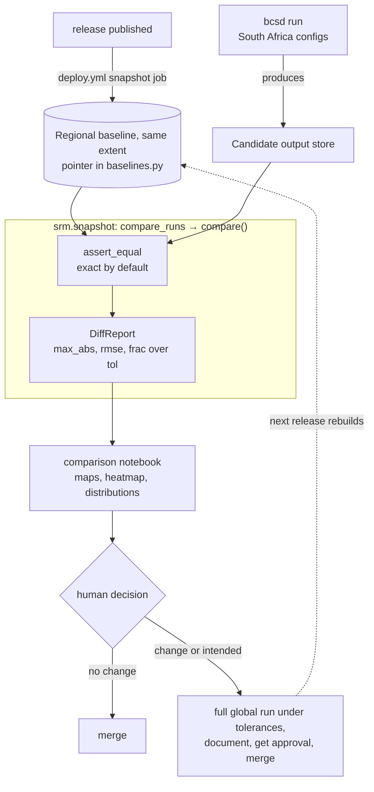

# Snapshot Regression Testing

This page explains why the BCSD pipeline has a snapshot regression check and why it is built the way it is. For the per-pull-request procedure, see [How to Compare a Run Against the Snapshot](../how-to/run-snapshot-tests.md). The check answers issue #410: catch scientific drift before it merges, without paying for a full global comparison on every change.

## How it works

A cheap South Africa run produces candidate output, and `compare_runs` diffs it against a regional baseline on the same extent for exact equality. The comparison notebook then renders the `DiffReport` as maps and tables for a human to judge.

## Why it exists, and why tolerances

Downscaled output is a long chain of numerical operations — bias correction, detrending, regridding, spatial disaggregation — layered on `ibicus`, `xarray_regrid`, `dask`, and `icechunk`. A refactor meant to be a no-op, or a routine dependency bump, can quietly shift a temperature field by a tenth of a degree across a whole scenario, with no test failing because the pipeline still produces a plausible dataset. The snapshot check makes that drift loud: it freezes a blessed run and compares fresh output against it cell by cell.

The default comparison is **exact equality**. Two runs of the same configs at the same commit over the same spatial extent are bit-identical, which has been measured rather than assumed, so any difference at all is a code change. `compare()` takes its verdict from `xarray.testing.assert_equal`, which also checks dimension names and index identity; `frac_over_tol` is descriptive and must not be used as the gate.

That holds only when both runs cover the same spatial extent, which is why the regional baseline shares the candidate's `subset_bounds`. Two runs over *different* extents disagree in the last digit or two the stored numbers can hold, roughly 0.00006 W/m² on a solar radiation field near 200 W/m². That is rounding, not science, but it is not zero, so a regional-versus-global comparison still needs a tolerance band; [issue #575](https://github.com/carbonplan/srm-downscaling/issues/575) tracks why.

For that case, pass `srm.snapshot.tolerances.TOLERANCES` to restore the band, which passes a cell when `abs(candidate - snapshot) <= atol + rtol * abs(snapshot)` (the `xarray.testing.assert_allclose` rule). A variable absent from the mapping is compared exactly, so a partial mapping can only tighten a comparison. In either mode a leaf passes only when no cell is over tolerance, no cell disagrees on NaN-ness, and the dimension names, shapes, and coordinates all match.

## Per-variable tolerances

One global tolerance cannot fit every variable, because they live on different scales. Temperature in kelvin sits around 250–310, where a small relative tolerance is meaningful; precipitation is dominated by near-zero values, where relative tolerance collapses to nothing and is replaced by a pure absolute tolerance. The policy is a per-variable table in `srm.snapshot.tolerances` with a default fallback — seed values loose enough to absorb cross-version noise and tight enough to catch a genuine shift, expected to be tuned as the team learns how much each variable wanders between blessed runs.

## The baseline and the cheap proxy

There are two baselines in `srm.snapshot.baselines`, each a store URI and an icechunk branch. "Which run is the baseline" is a version-controlled value that the notebook and `compare_runs` both read, so repointing is a reviewed edit rather than an untracked change on a bucket.

| pointer | mode | run | verdict |
|---|---|---|---|
| `CESM2_WACCM_SOUTH_AFRICA` | `southafrica` (default) | regional, same `subset_bounds` as the candidate | exact |
| `CESM2_WACCM_GLOBAL` | `global` | the blessed global run on [Source Cooperative](https://source.coop/carbonplan/srm-downscaling) | tolerance band |

The regional baseline is produced automatically by the `snapshot` job in `.github/workflows/deploy.yml` on every published release, then frozen under an icechunk tag. Repointing `CESM2_WACCM_SOUTH_AFRICA` at the new release is the one manual step, and the job's summary prints both fields to paste, the store URI as well as the branch.

Comparing full global output on every change would be prohibitively expensive, so the routine check runs over the South Africa subset. The [how-to guide](../how-to/run-snapshot-tests.md) covers the halo and trimming mechanics.

A regional baseline also removes a limitation the old global baseline carried. The bias correction fits a per-variable distribution: `tas`, `tasmax`, and `tasmin` use a numerically stable Gaussian, but `hurs`, `rsds`, and `dtr` use iterative maximum-likelihood fits (a beta distribution, with Weibull and Gumbel tails) that are sensitive to tiny input perturbations. Against a *global* baseline the domain window changes the regrid reduction order and perturbs those fits, so those three diff spuriously and have to be judged from `mode = "global"`. Against a same-extent regional baseline both sides feed identical inputs to the fits, so all seven variables are reliable and any difference is real.

## Human judgment and the label gate

The check produces evidence, not a merge decision. When every leaf is within tolerance and no change was intended, the pull request is safe to merge; when a leaf moves, or the change was meant to move the outputs, the author produces a full global run, documents what changed and why, and gets sign-off before merging and repointing the baseline. Leaves present on only one side are reported rather than silently skipped, so a variable that appears or disappears is never mistaken for "no change". The only automated gate is the `snapshot-required` workflow, which blocks a modeling-code change until it carries the `snapshot-verified` label and exempts docs-only changes — confirming the human process happened rather than recomputing a verdict of its own.
