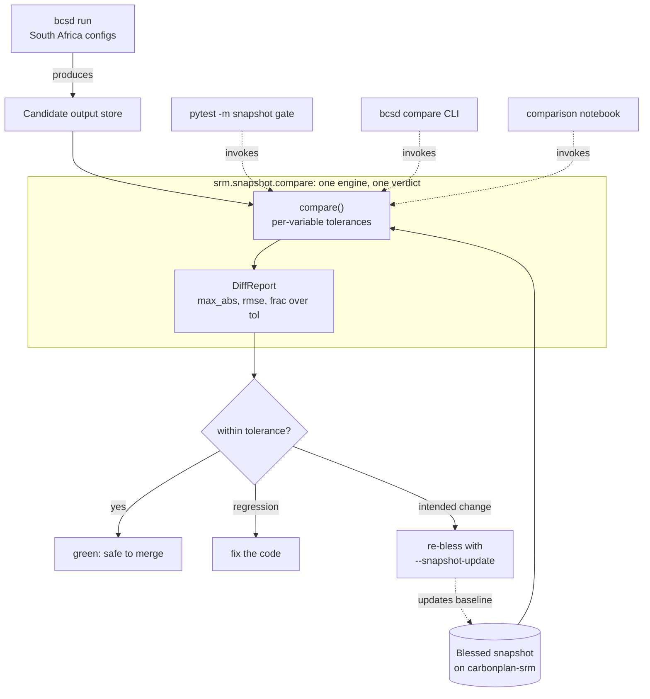

# Snapshot Regression Testing

This page explains why the BCSD pipeline has a snapshot regression test, what the test actually protects against, and why it is designed the way it is. It is background reading: for the commands that run and bless a snapshot, see [How to Run the Snapshot Regression Gate](../how-to/run-snapshot-tests.md), and for the exact `bcsd compare` interface, see the [CLI Reference](../reference/cli.md).

## How it works in action

At a high level, snapshot testing takes a fresh candidate run and a blessed baseline, compares them through a single tolerance-aware engine, and turns the result into a pass-or-investigate verdict. The same `compare()` engine backs the pytest gate, the `bcsd compare` CLI, and the comparison notebook, so every entry point reaches the identical conclusion.

The diagram traces the operational loop: a South Africa run produces candidate output, `compare()` measures it against the blessed snapshot under per-variable tolerances, and the verdict either clears the change to merge or flags drift. When the drift is an intended scientific improvement, re-blessing updates the baseline, which is the only path that overwrites the reference.

## The problem: silent scientific drift

Downscaled climate output is the product of a long chain of numerical operations — quantile-mapping bias correction, detrending, regridding, and spatial disaggregation — layered on top of libraries like `ibicus`, `xarray_regrid`, `dask`, and `icechunk`. When any link in that chain changes, the numbers can shift without any test failing, because the pipeline still runs to completion and still produces a plausible-looking dataset. A refactor meant to be a no-op, or a routine dependency bump, can quietly move a temperature field by a tenth of a degree across a whole scenario.

Snapshot testing exists to make that kind of drift loud instead of silent. The idea is to freeze a blessed run as a baseline and, on every subsequent change, compare fresh output against it cell by cell. If nothing moved beyond an expected floating-point wobble, the change is safe to merge; if something moved, a human decides whether the shift is an intended scientific improvement or an accidental regression.

## Why tolerance-aware comparison, not exact match

A bitwise or exact-equality comparison would be useless here, because the pipeline is not bit-reproducible. `dask` reductions accumulate in nondeterministic order, regridding weights differ subtly across library versions, and floating-point arithmetic is not associative, so two runs of identical code on identical inputs can disagree in the last few digits. A test that flagged those differences would fail constantly and teach everyone to ignore it.

The comparison is therefore tolerance-aware: a cell passes when `abs(candidate - snapshot) <= atol + rtol * abs(snapshot)`, the same rule as `xarray.testing.assert_allclose`. This absorbs the meaningless noise while still catching a real scientific change, which by construction is far larger than a rounding difference. The verdict for a whole leaf is simply that no cell is over tolerance, no cell disagrees on NaN-ness, and the shapes match.

## Per-variable tolerances

A single global tolerance cannot fit every variable, because the variables live on different scales and have different failure modes. Temperature fields in kelvin are well-behaved around 250–310, so a small relative tolerance is meaningful, but precipitation is dominated by values at or near zero, where relative tolerance is meaningless — `rtol * abs(snapshot)` collapses to nothing and every dry cell becomes hair-trigger sensitive. Precipitation is therefore given a pure absolute tolerance instead.

The policy lives in `srm.snapshot.tolerances` as a per-variable table, with a default fallback for anything unlisted. These seed values are deliberately loose enough to absorb cross-version nondeterminism and tight enough to catch a genuine shift; they are starting points, expected to be tuned as the team learns how much each variable actually wanders between blessed runs.

## The two-snapshot model

Comparing full global output on every change would be prohibitively expensive, so the design uses two scopes for two different moments. The cheap scope is a South Africa subset that acts as a proxy gate: it exercises the same code paths as a global run but over a small enough domain to produce and compare quickly, which makes it suitable for guarding pull requests. The expensive scope is the full global comparison, run on demand against a blessed global baseline when a change needs end-to-end confirmation.

The South Africa proxy and the global baseline are stored differently on purpose. The proxy compares against a `syrupy-geo` snapshot store keyed by package version, so blessing is a versioned, first-class artifact. The global baseline is instead a tracked pointer in `srm.snapshot.baselines`, so "repoint the comparison at the new global run" becomes a reviewed pull-request edit rather than an untracked side effect.

## One engine, one verdict

A subtle failure mode for this kind of tooling is disagreement between the automated gate and the human-facing diagnostics: the test says "pass" while the comparison notebook shows a visible difference, or vice versa. That happens whenever the gate and the notebook compute their verdicts independently, with tolerances that have drifted apart over time.

This design avoids that by routing every path through a single `compare()` engine in `srm.snapshot.compare`. The pytest gate reaches it through a `syrupy-geo` extension subclass, the `bcsd compare` CLI calls it directly, and the comparison notebook imports the same function, so all three necessarily agree on what "within tolerance" means. Changing the policy in one place changes it everywhere at once, which keeps the gate and the diagnostics honest with each other.

## The snapshot lifecycle

A baseline is created the first time the gate runs with an explicit blessing flag, which writes the current output to the snapshot store on `carbonplan-srm` under the installed package version. From then on the gate compares against that frozen copy, and it stays frozen until someone deliberately re-blesses it. This is the whole point: a baseline that updated itself automatically would silently launder regressions into the reference.

When a change is an intended scientific improvement rather than a regression, re-blessing is the correct response, and it is an explicit, reviewable act. Because snapshots are versioned like the pipeline itself, a blessed baseline is tied to the code and configuration that produced it, and the history of what "correct" meant at each version is preserved rather than overwritten.
