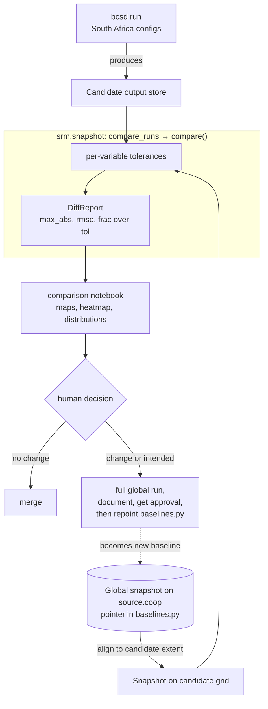

# Snapshot Regression Testing

This page explains why the BCSD pipeline has a snapshot regression check and why it is built the way it is. For the per-pull-request procedure, see [How to Compare a Run Against the Snapshot](../how-to/run-snapshot-tests.md). The check answers issue #410: catch scientific drift before it merges, without paying for a full global comparison on every change.

## How it works

A cheap South Africa run produces candidate output, and `compare_runs` aligns the canonical global snapshot to that extent and diffs the two under per-variable tolerances. The comparison notebook then renders the `DiffReport` as maps and tables for a human to judge.

## Why it exists, and why tolerances

Downscaled output is a long chain of numerical operations — bias correction, detrending, regridding, spatial disaggregation — layered on `ibicus`, `xarray_regrid`, `dask`, and `icechunk`. A refactor meant to be a no-op, or a routine dependency bump, can quietly shift a temperature field by a tenth of a degree across a whole scenario, with no test failing because the pipeline still produces a plausible dataset. The snapshot check makes that drift loud: it freezes a blessed run and compares fresh output against it cell by cell.

Exact equality would be useless, because the pipeline is not bit-reproducible — `dask` reductions accumulate in nondeterministic order and regridding weights differ across library versions. The comparison is therefore tolerance-aware, passing a cell when `abs(candidate - snapshot) <= atol + rtol * abs(snapshot)` (the `xarray.testing.assert_allclose` rule), and a leaf passes only when no cell exceeds tolerance, no cell disagrees on NaN-ness, and the shapes match. This absorbs rounding noise while still catching a real scientific change, which by construction is far larger.

## Per-variable tolerances

One global tolerance cannot fit every variable, because they live on different scales. Temperature in kelvin sits around 250–310, where a small relative tolerance is meaningful; precipitation is dominated by near-zero values, where relative tolerance collapses to nothing and is replaced by a pure absolute tolerance. The policy is a per-variable table in `srm.snapshot.tolerances` with a default fallback — seed values loose enough to absorb cross-version noise and tight enough to catch a genuine shift, expected to be tuned as the team learns how much each variable wanders between blessed runs.

## The baseline and the cheap proxy

There is one canonical baseline: the blessed global run in CarbonPlan's public [Source Cooperative repository](https://source.coop/carbonplan/srm-downscaling), recorded as a store URI and icechunk branch in `srm.snapshot.baselines.CESM2_WACCM_GLOBAL`. "Which run is the baseline" is therefore a version-controlled value that the notebook and `compare_runs` both read, so repointing it is a reviewed edit to `baselines.py` rather than an untracked change on a bucket. Comparing full global output on every change would be prohibitively expensive, so the routine check runs over a small South Africa subset instead; the [how-to guide](../how-to/run-snapshot-tests.md) covers the halo and trimming mechanics that make the subset comparable to the global baseline.

The subset proxy has one limitation worth knowing. The bias correction fits a per-variable distribution: `tas`, `tasmax`, and `tasmin` use a numerically stable Gaussian, but `hurs`, `rsds`, and `dtr` use iterative maximum-likelihood fits (a beta distribution, with Weibull and Gumbel tails) that are sensitive to tiny input perturbations. Windowing the domain changes the `dask` and regrid reduction order and perturbs those fits at the floating-point level, so `hurs`, `rsds`, and `dtr` can diff spuriously in a South-Africa-versus-global comparison — interior differences that a wider halo cannot fix. Judge those three from the full global comparison (`mode = "global"`), where both runs feed identical inputs to the fits; the cheap proxy is a reliable regression signal only for the numerically stable variables (`tas`, `tasmax`, `tasmin`, `pr`).

## Human judgment and the label gate

The check produces evidence, not a merge decision. When every leaf is within tolerance and no change was intended, the pull request is safe to merge; when a leaf moves, or the change was meant to move the outputs, the author produces a full global run, documents what changed and why, and gets sign-off before merging and repointing the baseline. Leaves present on only one side are reported rather than silently skipped, so a variable that appears or disappears is never mistaken for "no change". The only automated gate is the `snapshot-required` workflow, which blocks a modeling-code change until it carries the `snapshot-verified` label and exempts docs-only changes — confirming the human process happened rather than recomputing a verdict of its own.
