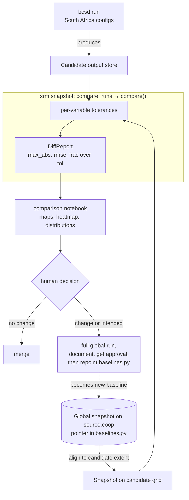

# Snapshot Regression Testing

The BCSD pipeline ships a snapshot regression check that catches scientific drift before it merges, without paying for a full global comparison on every change (issue #410). This page explains why the check exists and how its verdict is built; for the per-pull-request procedure, see [How to Compare a Run Against the Snapshot](../how-to/run-snapshot-tests.md).

## How it works

A cheap South Africa run produces candidate output, and `compare_runs` aligns the canonical global snapshot to that extent and diffs the two under per-variable tolerances. The comparison notebook then renders the resulting `DiffReport` as maps and tables for a human to judge.



## Why it exists

Downscaled output is a long chain of numerical operations (bias correction, detrending, regridding, spatial disaggregation) layered on `ibicus`, `xarray_regrid`, `dask`, and `icechunk`. A refactor meant to be a no-op, or a routine dependency bump, can quietly shift a temperature field by a tenth of a degree across a whole scenario with no test failing, because the pipeline still produces a plausible dataset. The snapshot check makes that drift loud by freezing an approved run and comparing fresh output against it cell by cell.

## Why tolerances instead of equality

The pipeline is not bit-reproducible, so exact equality would fail on every run: `dask` reductions accumulate in nondeterministic order, and regridding weights differ across library versions. The comparison is therefore tolerance-aware, following the `xarray.testing.assert_allclose` rule, which absorbs rounding noise while still catching a real scientific change:

```text
abs(candidate - snapshot) <= atol + rtol * abs(snapshot)
```

## Per-variable tolerances

One global tolerance cannot fit every variable, because they live on different scales. Temperature in kelvin sits around 250 to 310, where a small relative tolerance is meaningful, while precipitation is dominated by near-zero values where the relative term vanishes and the absolute floor does all the work. `rtol` is uniform at `1e-5`, so `atol` is the per-variable knob:

| Variable | `atol` | Why this value |
| --- | --- | --- |
| `tas`, `tasmax`, `dtr` | `1e-3` K | baseline for the temperature group |
| `tasmin` | `2e-3` K | derived as `tasmax - dtr`, so its drift can reach the sum of both inputs' floors |
| `pr` | `1e-10` kg m-2 s-1 | stored values are tiny, around `1e-5` |
| `rsds` | `1e-2` W m-2 | spans roughly 0 to 1000 |
| `hurs` | `1e-2` % | spans roughly 0 to 100 |

`srm.snapshot.tolerances` is authoritative, and unknown variables fall back to a default. These are seed values, expected to tighten as the team learns how much each variable wanders between approved runs.

## What a passing report means

`DiffReport.passed` combines two independent conditions, so a run can be numerically clean and still fail. Leaves present on only one side are reported rather than silently skipped, so a variable that appears or disappears is never mistaken for "no change".

- **`within_tolerance`**: every compared leaf is inside its tolerance, no cell disagrees on NaN-ness, and the shapes match. An empty report is False, so a comparison that compared nothing fails instead of passing.
- **`invariants_hold`**: cross-variable physical invariants on the candidate hold, currently `tasmax >= tasmin` (see the derived-variables section of [Pipeline architecture](pipeline-architecture.md)). Vacuously true when no invariant applies to the compared leaves.

## The baseline

There is one canonical baseline: the approved global run in CarbonPlan's public [Source Cooperative repository](https://source.coop/carbonplan/srm-downscaling), recorded as a store URI and icechunk branch in `srm.snapshot.baselines.CESM2_WACCM_GLOBAL`. Which run serves as the baseline is therefore a version-controlled value that the notebook and `compare_runs` both read, so repointing it is a reviewed edit to `baselines.py` rather than an untracked change on a bucket.

## Why the cheap proxy is only partial

Comparing full global output on every change would be prohibitively expensive, so the routine check runs over a small South Africa subset instead. That substitution is sound for some variables and not others, because bias correction fits a per-variable distribution:

| Variables | Distribution fit | Subset comparison |
| --- | --- | --- |
| `tas`, `tasmax`, `tasmin`, `pr` | numerically stable Gaussian | reliable regression signal |
| `hurs`, `rsds`, `dtr` | iterative maximum-likelihood (beta, with Weibull and Gumbel tails) | can diff spuriously |

Windowing the domain changes the `dask` and regrid reduction order, which perturbs the iterative fits at the floating-point level. Those differences are interior rather than boundary artifacts, so a wider halo cannot fix them, and `hurs`, `rsds`, and `dtr` should be judged from a full global comparison where both runs feed identical inputs to the fits. The [how-to guide](../how-to/run-snapshot-tests.md) covers the halo and trimming mechanics that make the subset comparable to the global baseline.

## Human judgment and the label gate

The check produces evidence, not a merge decision. When every leaf is within tolerance and no change was intended, the pull request is safe to merge; when a leaf moves, or the change was meant to move the outputs, the author produces a full global run, documents what changed and why, and gets sign-off before merging and repointing the baseline. The only automated gate is the `snapshot-required` workflow, which blocks a modeling-code change until it carries the `snapshot-verified` label, confirming that the human process happened rather than recomputing a verdict of its own.
