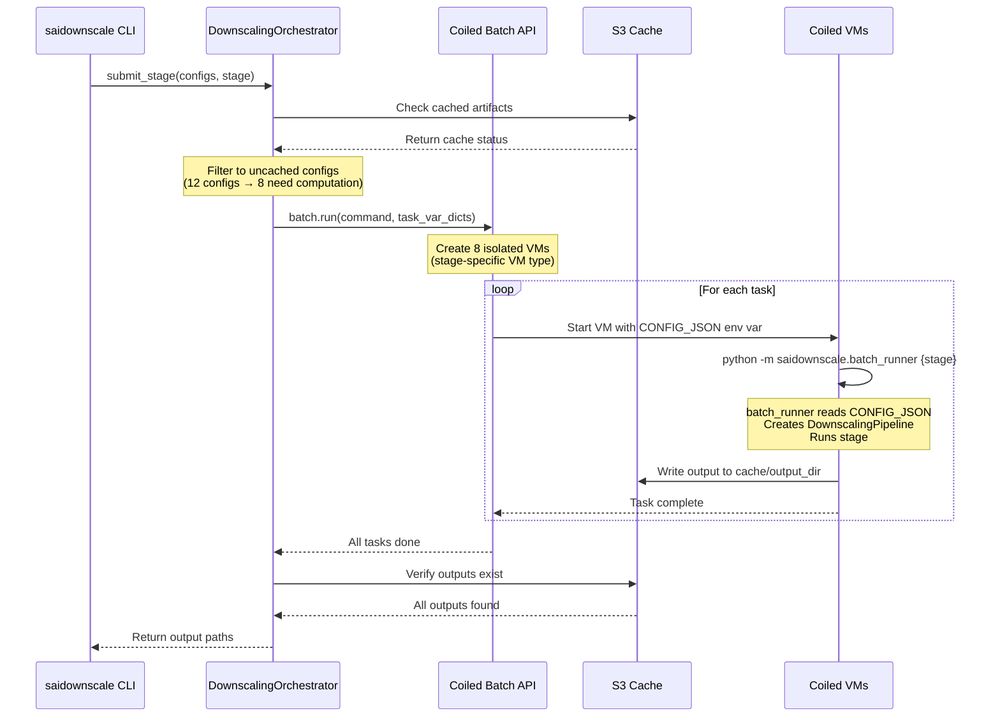
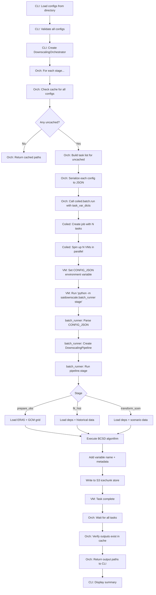

# Pipeline architecture

This page explains how we structured the downscaling pipeline, why we designed it that way, and how its components fit together. We also encourage developers to explore the extensive explanatory information in our [Github repo](https://github.com/carbonplan/sai-downscaling). These resources will help anyone interested in modifying or extending the pipeline for other use cases. We also welcome feedback or contributions by [opening an issue](https://github.com/carbonplan/sai-downscaling/issues/new)

## The 3-stage pipeline

The downscaling pipeline runs in 3 stages, each of which caches its artifacts and reuses them on a
later run. Every stage is keyed on the global climate model (GCM) it processes, among other things:

```mermaid
graph TB
    subgraph "Input Data"
        ERA5[ERA5 Observations<br/>0.25° resolution<br/>1950-present]
        GCM_HIST[GCM Historical<br/>~1-2° resolution<br/>1850-2014]
        GCM_SCEN[GCM Scenario<br/>~1-2° resolution<br/>2015-2100]
    end

    subgraph "Stage 1: prepare_observations"
        direction TB
        S1A[Load ERA5 at fine resolution]
        S1B[Load GCM grid as target]
        S1C[Apply spatial subset if specified]
        S1D[Regrid ERA5 to coarse GCM grid<br/>using local area averaging]
        S1E[Cache: obs_regridded<br/>Reused across all ensembles]
        
        S1A --> S1B --> S1C --> S1D --> S1E
    end

    subgraph "Stage 2: fit_historical"
        direction TB
        S2A[Load obs_regridded from cache]
        S2B[Load fine ERA5 observations]
        S2C[Load GCM Historical data]
        S2D[Apply spatial subset if specified]
        S2E[Time subset to training period<br/>1978-2014]
        S2F[Quantile mapping bias correction<br/>GCM historical → observations]
        S2FC[Write method/debiased_coarse/historical<br/>to output store]
        S2G[Spatial disaggregation<br/>coarse → fine resolution]
        S2H[Output: historical<br/>Deliverable + scenario gate]
        
        S2A --> S2B --> S2C --> S2D --> S2E
        S2E --> S2F --> S2FC
        S2F --> S2G --> S2H
    end

    subgraph "Stage 3: transform_scenario"
        direction TB
        S3A[Load obs_regridded from cache]
        S3B[Check historical exists<br/>completion gate]
        S3C[Load fine ERA5 observations]
        S3D[Load GCM Historical for training]
        S3E[Load GCM Scenario data]
        S3F[Apply spatial subset if specified]
        S3G[Time subset to prediction period<br/>2015-2100]
        
        S3H{Detrend needed?<br/>e.g., temperature}
        S3I[Calculate baseline climatology<br/>from historical period]
        S3J[Splice historical + scenario]
        S3K[Detrend scenario data<br/>9-year running mean]
        S3L[Save trend for later]
        
        S3M[Quantile mapping bias correction<br/>using historical period CDFs]
        
        S3N{Re-trend needed?}
        S3O[Add saved trend back]
        S3OC[Write method/debiased_coarse/scenario<br/>to output store]
        
        S3P[Spatial disaggregation<br/>coarse → fine resolution]
        S3Q[Add variable name and metadata]
        S3R[Write to output_dir<br/>Final publishable result]
        
        S3A --> S3B --> S3C --> S3D --> S3E
        S3E --> S3F --> S3G
        S3G --> S3H
        S3H -->|Yes| S3I --> S3J --> S3K --> S3L --> S3M
        S3H -->|No| S3M
        S3M --> S3N
        S3N -->|Yes| S3O --> S3OC
        S3N -->|No| S3OC
        S3OC --> S3P
        S3P --> S3Q --> S3R
    end

    ERA5 --> S1A
    GCM_HIST --> S1B
    GCM_HIST --> S2C
    GCM_HIST --> S3D
    GCM_SCEN --> S3E
    
    S1E -.-> S2A
    S1E -.-> S3A
    S2H -.-> S3B
    
    style S1E fill:#90EE90
    style S2H fill:#FFD700
    style S3R fill:#FFD700
    
    classDef cacheNode fill:#90EE90,stroke:#228B22,stroke-width:2px
    classDef outputNode fill:#FFD700,stroke:#FF8C00,stroke-width:2px
```



**Key points:**

- **stage 1 (prepare_observations)**: runs once per (GCM, obs_dataset, variable, spatial_subset)
  combination. The key deliberately omits `downscaling_method`, because regridding observations to
  the coarse grid does not consult `variable_config`, so `BCSD` and `QDMSD` share one artifact.
- **stage 2 (fit_historical)**: runs once per (GCM, obs_dataset, variable, downscaling_method,
  ensemble_member, spatial_subset) combination, and writes fine-res historical **and** debiased
  coarse historical to the output store (coarse only for `dtr`, see
  [`dtr` is bias-corrected but not published](#dtr-is-bias-corrected-but-not-published)). The method
  belongs in the key because each one writes its own `{method}/historical/…` group.
- **stage 3 (transform_scenario)**: runs for each scenario configuration, and writes fine-res
  scenario and debiased coarse scenario to the output store (coarse only for `dtr`).
- **green boxes**: cached intermediate artifacts (observations regridded) in the scratch icechunk
  store, on the active branch.
- **gold boxes**: deliverables in the output icechunk store, on the active branch: fine-res
  historical, fine-res scenario, and debiased coarse data.
- **dotted arrows**: cache dependencies, validated automatically.

## Derived variables: `tasmin`

We do **not** bias-correct daily minimum temperature directly. Bias-correcting `tasmax` and
`tasmin` independently can leave the pair physically inconsistent, so the pipeline instead
bias-corrects `tasmax` and the diurnal temperature range `dtr` (`= tasmax − tasmin`) and
reconstructs `tasmin = tasmax − dtr` from their debiased-coarse outputs. This mirrors the NASA-NEX
approach, and we implement it in the dedicated stage variants `fit_historical_tasmin` and
`transform_scenario_tasmin`, which read the `debiased_coarse` `tasmax` and `dtr` groups those stages
write (see the
[cache guide](https://github.com/carbonplan/sai-downscaling/blob/main/docs/how-to/manage-cache.md)
in the repository). The reconstruction helper
(`derive_tasmin`) requires its 2 inputs to share an identical time axis and raises if they do not,
so a truncated or misaligned `dtr` fails loudly instead of silently NaN-filling the result
(issue #363).

We still spatially disaggregate `tasmax` and `tasmin` **independently**, and that final
interpolation can push a small number of fine cells to `tasmax < tasmin`. A dedicated reconcile step
(`reconcile_temperature_extremes`) closes this gap: once both fine fields exist it swaps the
offending cells so `tasmax >= tasmin` holds everywhere, then rewrites both corrected fields
(issue #331). The swap is NaN-safe and structurally monotone, and the `saidownscale validate-output`
gate blocks any run whose stored output still contains an inversion.

Both behaviors are keyed on the **variable**, not on which entry point runs the stage.
`fit_historical` and `transform_scenario` route a `tasmin` config to their `_tasmin` variants at the
top of the method, so the distributed `batch_runner`, the local `run_full_pipeline`, and the CLI all
produce derived-and-reconciled `tasmin` identically. Because the derivation reads the `tasmax` and
`dtr` outputs, `tasmin` must run after them, and `DownscalingOrchestrator` enforces that by
scheduling `tasmin` in a later intra-stage dependency wave.

## `dtr` is bias-corrected but not published

`dtr` exists only to make the `tasmin` reconstruction possible. The reconcile step above adjusts
the fine `tasmax` and `tasmin` pair without revisiting `dtr`, so a disaggregated `dtr` would no
longer equal `tasmax − tasmin` and would mislead anyone reading it as the diurnal range. Both stages
therefore return immediately after writing its `debiased_coarse` group (issue #461), which gives the
behavior in the table below.

| Aspect | Behavior for `dtr` |
| --- | --- |
| Groups written | `{method}/debiased_coarse/historical/dtr/{member}` and `{method}/debiased_coarse/{scenario_group}/dtr/{member}` only |
| Groups **not** written | `{method}/historical/dtr/{member}`, `{method}/{scenario_group}/dtr/{member}` |
| Spatial disaggregation | Skipped entirely, so the stage's most expensive step never runs |
| Stage-completion marker | The `debiased_coarse` group, via `ArtifactCache.stage_loc` |
| Config files | Unchanged: `dtr` stays in every `variables:` list, because `tasmin` needs it |

We declare the rule once, as `COARSE_ONLY_VARIABLES` in `src/saidownscale/cache.py`.
`ArtifactCache.stage_loc` is the single place that maps a stage to the artifact marking it complete,
so the pipeline's write path, the orchestrator's cache-skip and retry logic, and the downstream
dependency gate all agree on where `dtr` ends.

## Cache store structure

Each `(GCM, obs-dataset, spatial-subset)` combination gets exactly 2 icechunk repositories, one for
scratch intermediates and one for final outputs. Every artifact group lives inside those
repositories as a zarr group path on a named branch, which defaults to the installed package
version:

```text
# Scratch store: obs regridded plus optional intermediates
s3://carbonplan-srm/scratch/cache/{environment}/{gcm}-{obs_dataset}-{subset_id}.icechunk
  branch: v1.2.3        ← installed package version (SAIDOWNSCALE_BRANCH to override)
    obs/{variable}                                                   # shared by both methods
    {method}/detrended_scenario/{scenario_group}/{variable}/{ensemble_member}  # only if save_intermediate=True
    {method}/trend_scenario/{scenario_group}/{variable}/{ensemble_member}      # only if save_intermediate=True
    {method}/debiased_scenario/{scenario_group}/{variable}/{ensemble_member}   # only if save_intermediate=True

# Output store: fine-res historical, scenario results, and debiased coarse data
s3://carbonplan-srm/scratch/output/{environment}/{gcm}-{obs_dataset}-{subset_id}.icechunk
  branch: v1.2.3
    {method}/historical/{variable}/{hist_member}
    {method}/{scenario_group}/{variable}/{ensemble_member}
    {method}/debiased_coarse/historical/{variable}/{hist_member}
    {method}/debiased_coarse/{scenario_group}/{variable}/{ensemble_member}
```

Where:

- `{environment}`: `qa` or `production`
- `{method}`: `bcsd` or `qdmsd`, the lowercase `downscaling_method`. Stage 1 output is
  method-independent, so `obs/` sits outside it and both methods share a single regrid. Stages 2 and
  3 differ between methods, so we namespace their artifacts.
- `{obs_dataset}`: `ERA5` or `GDEX-GMF`
- `{subset_id}`: `global` or `lat{min}to{max}_lon{min}to{max}` (e.g.,
  `lat-35.0to-22.0_lon16.0to33.0`)
- `{scenario_group}`: `ssp245`, `g6_1p5k`, or `esgf_ssp245`
- `{ensemble_member}`: member label as stored in the GCM (e.g., `r1i1p1f1`, `001`)

This design concentrates all artifacts for a GCM into 2 stores instead of scattering them across
dozens of separate icechunk repositories. Branching, rather than path segments, provides version
isolation: bumping the package version, or setting `SAIDOWNSCALE_BRANCH`, starts a fresh branch with
no inherited ancestry, so the existence checks never find stale artifacts from a previous run.

The paths above are the scratch defaults. Production runs override `output_dir` to CarbonPlan's
public [Source Cooperative repository](https://source.coop/carbonplan/srm-downscaling). For the
current store paths and release branch, see
[Data location](../access-data/whats-available.md#data-location), and see
[Access utilities](../access-data/access-utilities.md) for reading published stores.

## Distributed execution

Every stage task is one `(gcm, scenario, ensemble member, variable)` leaf that reads a config, runs
a stage, writes to S3, and exits. The tasks never talk to each other, so the pipeline needs task
placement rather than a distributed scheduler.

`DownscalingOrchestrator.submit_stage` dispatches through an executor seam, and all 3 executors
share the signature `(stage, configs) -> list[str]`. Everything upstream of that seam is
executor-agnostic, so the table below is the whole of the difference.

| Executor | Mechanism | Cost per vCPU-hour |
| --- | --- | --- |
| `aws-batch` | AWS Batch array jobs on Graviton instances | $0.0589 (EC2 only) |
| `coiled` | [Coiled](https://coiled.io) batch API | $0.1089 (EC2 plus a $0.05 platform fee) |
| `local` | Sequential, in the current process | none |

Our deploys use `aws-batch`. The output is identical either way, because both remote executors run
the same `saidownscale.batch_runner` entry point against the same config payload.

### Config delivery differs between the 2 remote executors

Coiled Batch sets a distinct `CONFIG_JSON` per task through `map_over_task_var_dicts`. AWS Batch
array jobs cannot vary the environment per child, since every child shares one job definition and
one set of container overrides, and only `AWS_BATCH_JOB_ARRAY_INDEX` differs.

The AWS Batch path therefore writes one manifest to S3 per submission and has each child read its
own entry by index. Manifest entries are byte-identical to the `CONFIG_JSON` payload, so
`batch_runner` needs a new way to obtain the dict, not a new way to parse it. A wave of exactly one
task skips the manifest and carries `CONFIG_JSON` directly, because `arrayProperties.size` must be
at least 2.

### Success is decided by the cache, never the exit code

A task can exit zero without producing output, so both remote executors sweep `ArtifactCache` after
the job finishes and raise if any config is missing its artifact. Cache presence is proof only for
artifacts the run itself created, which is every one of them unless `--force` is set. Under
`--force` the artifacts found may predate the job, so those additionally require the job to have
reported success.

### Coiled architecture

The sequence below is the Coiled path specifically. The AWS Batch path differs only in how a task
receives its config, described above, and in submitting an array job in place of a set of per-task
virtual machines (VMs).



### Key benefits

1. **isolation**: each task runs on its own VM with dedicated resources
2. **parallelization**: many ensemble members process at once
3. **auto-scaling**: VMs spin up on demand and shut down when done
4. **fault tolerance**: a failed task retries independently of the others
5. **reproducibility**: we serialize the configuration and pass it to each task

### VM configuration

We select the VM type per pipeline stage to match resource requirements. A spatially subset run uses
a smaller ladder, because every stage applies `subset_space` before any heavy compute, so the box
size rather than the source grid sets the working set:

| Stage | Global | Regional | Notes |
| --- | --- | --- | --- |
| `prepare_observations` | `r8g.4xlarge` | `r8g.2xlarge` | Light data processing |
| `fit_historical` | `r8g.12xlarge` | `r8g.2xlarge` | Memory-intensive quantile mapping fits |
| `transform_scenario` | `r8g.24xlarge` | `r8g.4xlarge` | 768GB RAM, 96 vCPUs, AWS Graviton |

AWS Batch takes resource requirements rather than instance types and picks the instance itself.
`_resources_for` derives those requirements from this same table, asking for the vCPU count of the
chosen instance and 7680 MiB per vCPU, which fills the instance while leaving the ECS agent and the
OS their share. Deriving rather than tabulating keeps the Batch request and the cost estimate from
drifting apart.

- **region**: `us-west-2`, the same region as the S3 data
- **keepalive**: VMs stay alive briefly after a task completes, for follow-up work
- **AWS credentials**: not forwarded to VMs, which use an instance profile or environment-level
  credentials instead

## Code organization

We build the CLI on the components below. Each one owns a single concern, and the links go to the
module that implements it.

1. **DownscalingConfig** and **PipelineOptions**, in
   [src/saidownscale/downscaling_config.py](https://github.com/carbonplan/sai-downscaling/blob/main/src/saidownscale/downscaling_config.py)
   - **DownscalingConfig** holds run identity: `gcm`, `variable`, `ensemble_member`, `scenario`,
     time periods, `subset_bounds`, and `variable_config`. It carries field validators for
     stratospheric aerosol injection (SAI) scenarios, time periods, and spatial bounds, and the
     computed fields `run_id`, `config_hash`, and `is_sai_scenario`. Variable-specific parameters
     such as `detrend_data`, `disaggregation_method`, and `debias_approach` live only on the nested
     `variable_config`, never as accessors on `DownscalingConfig`. The required top-level
     `downscaling_method` (`BCSD` or `QDMSD`) is a `DownscalingConfig` field: it selects which
     per-variable defaults table `variable_config` is read from.
   - **PipelineOptions** holds operational settings: `scratch_dir`, `output_dir`, `environment`,
     `branch`, `verbose`, `rechunk_workflow`, `apply_ocean_mask`, `save_intermediate`,
     `clip_values`, and `clip_bounds`. The `branch` field, which defaults to the installed package
     version, names the icechunk branch all artifacts are written to and read from.
   - Both extend `pydantic_settings.BaseSettings` with `env_prefix = "SAIDOWNSCALE_"` and
     `extra = "ignore"`, so a single flat YAML populates both classes.

2. **ArtifactCache**, in
   [src/saidownscale/cache.py](https://github.com/carbonplan/sai-downscaling/blob/main/src/saidownscale/cache.py)
   - S3-based cache with fsspec backend
   - dependency tracking and validation
   - environment and spatial subset awareness
   - icechunk format with commit-based write verification
   - efficient prefix-based listing (not recursive globbing)

3. **DownscalingPipeline**, in
   [src/saidownscale/pipeline.py](https://github.com/carbonplan/sai-downscaling/blob/main/src/saidownscale/pipeline.py)
   - a 3-stage API
   - each stage: check cache → compute if needed → write to cache
   - automatic metadata preservation (units, attributes)
   - rechunking strategy for optimal Dask performance

4. **DownscalingOrchestrator**, in
   [src/saidownscale/orchestration.py](https://github.com/carbonplan/sai-downscaling/blob/main/src/saidownscale/orchestration.py)
   - batch execution with Coiled integration
   - automatic task deduplication across stages
   - status tracking and reporting
   - error handling and output verification

5. **batch_runner**, in
   [src/saidownscale/batch_runner.py](https://github.com/carbonplan/sai-downscaling/blob/main/src/saidownscale/batch_runner.py)
   - entry point for Coiled batch jobs
   - reads `CONFIG_JSON` environment variable (structure:
     `{"options": {...PipelineOptions fields...}, ...DownscalingConfig fields...}`)
   - pops the `"options"` key to construct `PipelineOptions`; remaining keys construct
     `DownscalingConfig`
   - creates `DownscalingPipeline(config, options)` and runs the requested stage
   - minimal dependencies for fast VM startup

6. **CLI**, in
   [src/saidownscale/cli.py](https://github.com/carbonplan/sai-downscaling/blob/main/src/saidownscale/cli.py)
   - typer-based command-line interface
   - rich formatting for tables and progress display
   - configuration loading and validation
   - orchestrator coordination

## Batch execution flow (Coiled)

The diagram below is the detailed flow when you run
`uv run saidownscale run --config-path configs/ --executor coiled`. Under `--executor aws-batch` the
middle of this flow changes shape: the orchestrator writes one S3 manifest instead of per-task
variables, submits a single array job instead of N VMs, and each child reads its entry by
`AWS_BATCH_JOB_ARRAY_INDEX`. The cache verification at the end is identical.



## Artifact location and existence checks

`ArtifactCache` translates a `DownscalingConfig` into a `StoreLocation`, which pairs an icechunk
repository path with a zarr group path within it. The store path derives from
`(environment, gcm, obs_dataset, subset_id)`, and the group path encodes the stage and the specific
run parameters: variable, ensemble member, and scenario group. Because both components are
deterministic given the config, the same config always maps to the same `StoreLocation` on every run
and across machines.

We check existence by walking the icechunk commit ancestry on the current branch and looking for a
commit whose message equals the group path. That check is atomic: a partially written group, whose
commit was never finalized, is invisible to it, so an interrupted run can safely resume by writing
the group again without risking a false cache hit.
